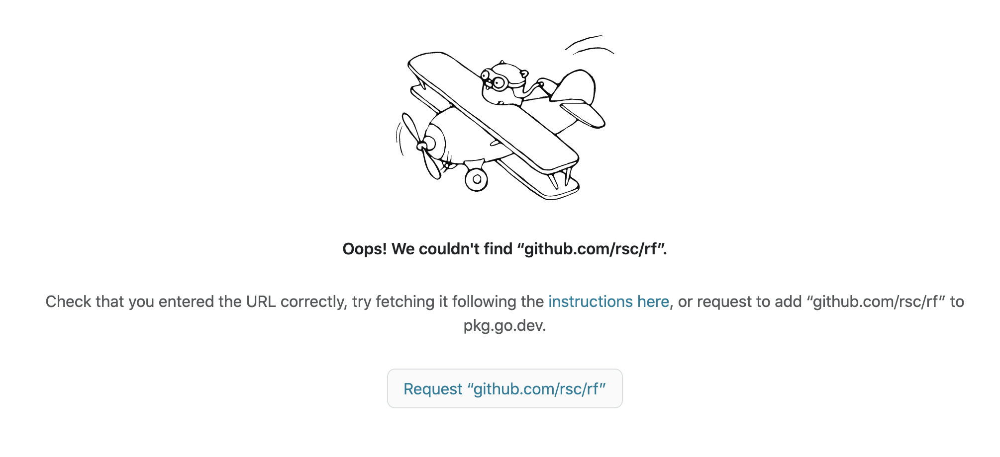

前天发了一篇文章，介绍了 Go 的名人，[Go Team 现在的 Leader Russ Cox](https://mp.weixin.qq.com/s/kmcJRBahAl4gtPzZUvd5bg)。

## 01

这两天在大牛的 GitHub 上看到他开源了一个新的工具：一个实验性的，用于 Go 语言的重构工具。

项目地址：<https://github.com/rsc/rf>。

开源后，立马有人跟进：<https://changelog.com/news/russ-coxs-experimental-new-refactoring-tool-for-go-NoN0>

> It’s just 18 commits deep at the time of logging, but when one of Go’s authors fires up a new project (and a refactoring tool at that), it’s worth following along to see what develops.

目前该工具还不成熟。我初步猜测，如果成熟了，可能会被用于各大文本编辑器，辅助进行 Go 代码重构。

目前项目的 README.md 上没什么说明，但有一个 doc.go 文件。我尝试使用 pkg.go.dev 查看，发现 404：<https://pkg.go.dev/github.com/rsc/rf>

这时点击下方的 Request “github.com/rsc/rf”，页面提示：

> “github.com/rsc/rf” is not a valid package or module. Were you looking for “rsc.io/rf”?

因此改为 <https://pkg.go.dev/rsc.io/rf> 即可正常访问。在该项目的 go.mod 文件中开头有这一行：

> module rsc.io/rf

官方号称 pkg.go.dev 是更懂 go mod 的，我觉得访问 <https://pkg.go.dev/github.com/rsc/rf> 应该能自动重定向到 https://pkg.go.dev/rsc.io/rf 才对。有兴趣的可以看看 rf 的文档。

> 知识点：上面 github.com/rsc/rf 之所以可以定义为 rsc.io/rf，是因为 rsc.io/rf 做了自定义包导入路径。你可以通过 `curl https://rsc.io/rf` 命令，查看输出结果，其中有这么一行代码：`<meta name="go-import" content="rsc.io/rf git https://github.com/rsc/rf">` 这是关键。

## 02

借此，介绍 Russ Cox 另外两个开源项目，当然是 Go 语言实现的。

- Two-factor 验证命令行工具，Star 数 1.1k+，项目地址：<https://github.com/rsc/2fa>；
- 大型文件树上的快速索引正则表达式搜索工具，Star 数 2.5k+，项目地址：<https://github.com/google/codesearch>，他还专门写了文章介绍。Google 代码搜索是如何工作的？<https://swtch.com/~rsc/regexp/regexp4.html>

## 03

借用曹大（Xargin）的话，你应该在 GitHub 上关注那些大神，通过他们的动态可以发现好玩的东西，更可以学习到新东西！

我不是大牛，但我会经常 Star 一些 Go 项目，欢迎大家去 GitHub 关注我：<https://github.com/polaris1119>。