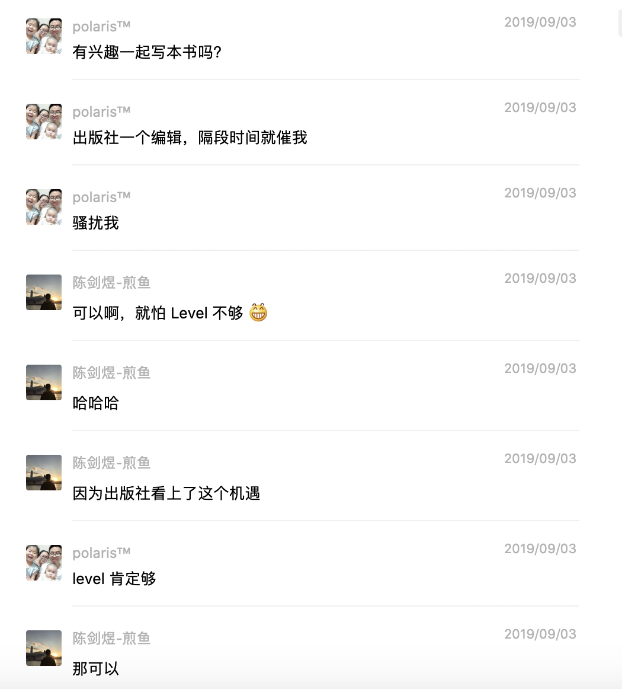

2020 年过去了一半，这半年对所有人来说都不寻常。但也是这场疫情，让我完成了一件大事：出了一本 Go 语言图书，书名是：《Go 语言编程之旅：一起用 Go 做项目》。

## 海报

先上海报：

全书共分为 6 章，分别是命令行应用、HTTP 应用、RPC 应用、WebSocket 应用、进程内缓存和 Go 语言中的大杀器，其中前 5 章是 Go 语言开发中最常见的项目类型。本书对项目开发、细节分析、运行时分析等核心内容进行了较为深入的剖析，提供了相对完整的项目实践经验。在项目迭代过程中，难免会遇到问题，因此本书针对 Go 语言的大杀器（分析工具）及常见问题进行了全面讲解，帮助读者对各类问题进行排查。本书适合有一定 Go 语言基础的读者以及相关开发人员阅读。

## 写书那些事

2019 年 8 月份，博文视点的安娜加我微信，想我出一本 Go 语言的图书。因为时间关系，我并没有打算出。安娜直接约我见面聊，到我公司找我，还送我一本书。之后在微信上多次问我有无意向。有点心动，但担心烂尾。

之前跟 《Go 语言高级编程》的作者柴大交流，他写书时，因为怕烂尾，邀请了曹大一起，两个人相互鼓励、交流、讨论能更好的的完成。正好 2019 年年初认识了煎鱼，之后交流也比较多，他产出很高，写的文章质量不错，于是我和他沟通一起出书的事情。

事实证明我没看错人，煎鱼很靠谱，很自律，产出高、质量高，由于我比较忙，因此他主动承担了更多内容，不是找了他，这本书现在肯定不会面世。因此，他理所当然成为了第一作者。由衷感谢，合作愉快。2019 年 12 月中旬我还去了一趟深圳，和煎鱼一起吃了顿饭，交流了很多。年轻人很有想法，前途无量！

所以，看了很多煎鱼文章的，欢迎购买支持；如果你在学习 Go 语言的过程中，Go 语言中文网对你有点帮助，我运营的社区对你有帮助，欢迎购买支持；如果苦于学了 Go 没法实践，这本书也许可以帮助你，那就下单购买吧。

目前京东 7.5 折。

## 感谢

最后感谢我的伙伴煎鱼，感谢博文编辑美丽的安娜，感谢曹大、无闻、杨文大佬推荐，感谢傲飞、大彬、晓东花费宝贵的时间进行 Review。同时要感谢我的老婆，春节期间对我无微不至的照顾，让我全身心投入该书的写作中。

