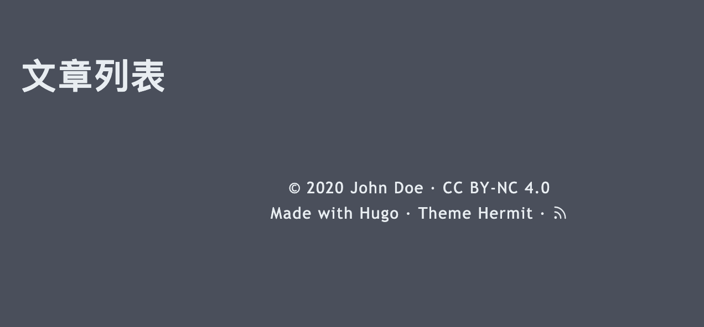
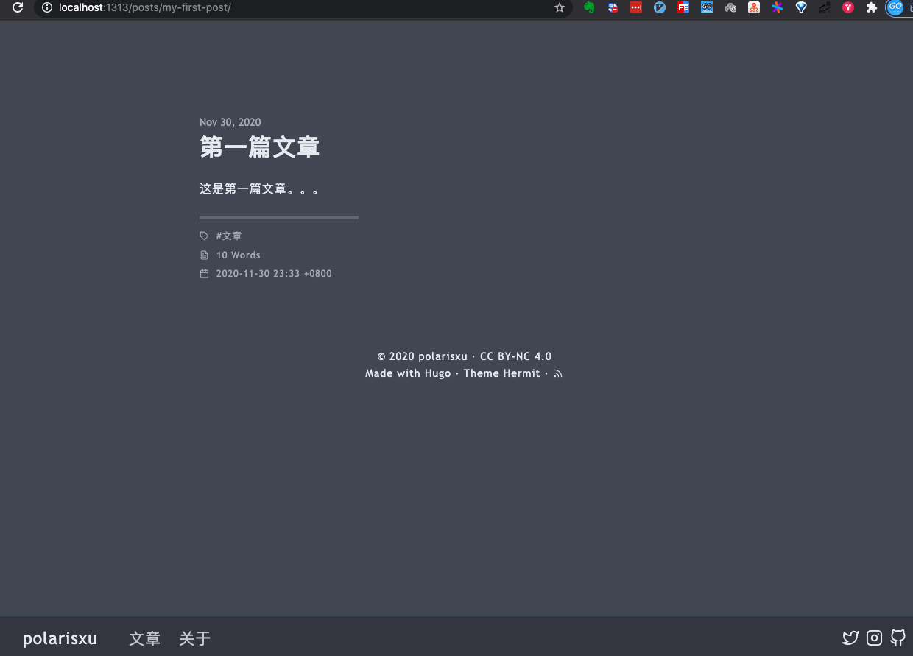
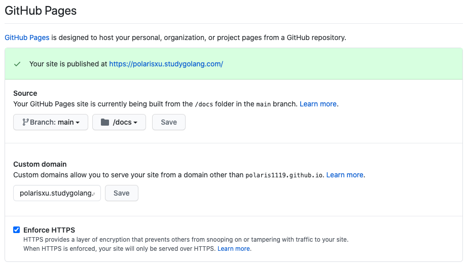

大家好，我是站长 polarisxu。

很早之前，我使用 WordPress 搭建了个人博客：<http://blog.studygolang.com>，毕竟那时候 WordPress 是首选。现如今，大家似乎更喜欢静态博客，各种语言的静态博客生成器轮子不断，比如 Go 语言的 Hugo 就是一个静态博客生成器。我个人认为，静态博客生成器流行的一个很大原因，是 Markdown 的流行，开发人员习惯了使用 Markdown 进行写作。

对于我，有另外一个痛点。最近在公众号写了一些文章，希望同步到博客，只是文字还好处理些，如果涉及到图片，微信公众号上传了一次，博客还得再来一次，挺费劲的。同时，为了保留最原始的文字，原始博文放在 GitHub 是一个不错的选择（用 Git 保留你的修改，不要太棒好嘛！）。

既然博文都保存在了 GitHub 上，怎么方便快速的基于 GitHub 来搭建自己的博客呢？（有些人直接就让在 GitHub 阅读，虽然可以，但体验还是不太好，而且看起来没有那么高大上，是不是？）

我想过使用 GitBook 来搭建，安装时，发现官方已经不维护 gitbook-cli 了，而且每次新增加文章，都得维护目录等，也是挺费劲的。于是放弃了这种方式。

这时我想到了通过静态博客生成器来搞。最喜欢 Go，自然 Hugo 成为第一选择。

废话不多少，记录下我搭建的过程。

## 01 安装 Hugo

你可以通过 <https://github.com/gohugoio/hugo/releases> 下载相应的安装包，我喜欢源码安装。

```bash
$ go get -v github.com/gohugoio/hugo
```

如果你也想通过源码安装，请自行准备好 Go 环境。

查看版本同时验证是否安装成功：（查看该文时，最新版本可能变了）

```bash
$ hugo version
Hugo Static Site Generator v0.76.5 darwin/amd64 BuildDate: unknown
```

## 02 使用 Hugo

在你本机某个目录执行如下命令，创建一个网站，我使用 polarisxu 这个名字。

```bash
$ hugo new site polarisxu
Congratulations! Your new Hugo site is created in /Users/xuxinhua/project/testhugo/polarisxu.

Just a few more steps and you're ready to go:

1. Download a theme into the same-named folder.
   Choose a theme from https://themes.gohugo.io/ or
   create your own with the "hugo new theme <THEMENAME>" command.
2. Perhaps you want to add some content. You can add single files
   with "hugo new <SECTIONNAME>/<FILENAME>.<FORMAT>".
3. Start the built-in live server via "hugo server".

Visit https://gohugo.io/ for quickstart guide and full documentation.
```

进入 polarisxu 目录，查看目录结构如下：

```bash
$ tree
.
├── archetypes
│   └── default.md
├── config.toml
├── content
├── data
├── layouts
├── static
└── themes

6 directories, 2 files
```

接下来需要为我们的网站指定一个主题，这里我们选择 <https://themes.gohugo.io/hermit/> 这个主题。

```bash
$ git clone https://github.com/Track3/hermit.git themes/hermit
```

将该主题增加到网站的配置文件中，这样才能生效：

```bash
echo 'theme = "hermit"' >> config.toml
```

测试下是否成功，运行：

```bash
$ hugo serve
```

打开浏览器访问：<http://localhost:1313/>，看到如下内容：


对该主题进行一些配置。一般的，主题会有例子，我们直接拷贝例子中的 config.toml 覆盖网站的 config.toml：

```bash
$ cp -rf themes/hermit/exampleSite/config.toml .
```

再次运行 `hugo serve`，页面如下：


可见，这个页面内容可以通过 config.toml 配置，根据需要做一些修改，页面变成这样：（不同主题可能不一样）


不过点击 「文章」 和 「关于」 都报 404。

### 增加列表页

在 content/posts 目录下新增一个文件：`_index.md`，内容如下：

```markdown
---
title: "文章列表"
---
```

这时（hugo serve 会自动编译）点击 Posts，页面如下：



### 增加 About 页面

同样的，在 content/posts 目录下新增文件 `about.md`，正文内容随意，类似这样：

```markdown
---
title: "关于"
date: "2020-12-01"
---

这是关于页面，polarisxu。
```

### 测试文章

接着，增加一篇测试文章：

```bash
$ hugo new posts/my-first-post.md
```

这会在 content/posts 目录下生成一个 my-first-post.md 文件，里面内容如下：

```markdown
---
title: "My First Post"
date: 2020-11-30T23:33:03+08:00
draft: true
toc: false
images:
tags:
  - untagged
---
```

其中 `---` 之间的数据是文章的元数据，在 Hugo 中叫做 [Front Matter](https://gohugo.io/content-management/front-matter/)。

随意增加一些内容，并做一些修改：（其中 isCJKLanguage: true 用于准确计算中文字数）

```markdown
---
title: "第一篇文章"
date: 2020-11-30T23:33:03+08:00
draft: false
toc: false
isCJKLanguage: true
images:
tags: 
  - 文章
---

这是第一篇文章。。。
```

查看文章详情：<http://localhost:1313/posts/my-first-post/>。



如果文章完成，可以执行 `hugo` 命令，生成静态页面。默认会将生成的静态页面放入 public 目录中。

关于 Hugo 更多的定制，比如 theme 的定制，这里不过多讲解，有兴趣的自己琢磨。比如虽然 <https://polarisxu.studygolang.com/> 和这里的例子使用了同一个模板，但样子却有不少不同，你可以查看 <https://github.com/polaris1119/polarisxu>，对比到底做了什么，折腾一番，基本会了。

## 03 使用 GitHub Pages 部署站点

这是 GitHub 为你和你的项目准备网站的，GitHub Pages 官方站点：<https://pages.github.com/>，大概就是通过将网站内容放到 GitHub，通过 GitHub Pages 可以弄出一个自己的站点。它最常使用的是通过 Jekyll 这个站点生成器生成静态页面，有兴趣的自行查阅资料了解。我们应该使用 Hugo 生成静态页面，因此直接将静态页面部署到 GitHub Pages。

### 创建一个特殊的仓库

在 GitHub 上创建一个仓库，不过仓库名有特殊要求。如果是个人账号，比如我的 GitHub ID 是 polaris1119，则仓库名是：polaris1119.github.io；如果是组织账号，比如 studygolang 这个组织，则仓库名是：studygolang.github.io。

### 配置仓库

进入仓库的 Settings 页面，有一个区块叫 GitHub Pages，可以配置站点信息，比如内容来源、自定义域名、是否启用 HTTPS 等。



说明如下：

- 数据源默认使用主分支下的根目录，我个人建议改为 docs 目录；
- 自定义域名如果留空，则默认仓库名就是你的域名，比如我这里的 polaris1119.github.io；
- 如果配置了自定义域名，则需要在你的域名配置上 CNAME 记录。我这里就是 polarisxu 这个子域名的 CNAME 值是 polaris1119.github.io；
- 如果配置了自定义域名，启用 HTTPS 需要等待一段时间才能生效；

你可以在该仓库上正确的位置放置一个 index.html 文件，测试是否正常。

> 小细节：避免 Jekyll 起作用，可以在仓库根目录放一个空文件，文件名： .nojekyll

### 部署我们的站点

这里有两种做法。

**1）方法一**

上面 Hugo 项目的代码直接推送到 GitHub Pages 这个仓库中，在通过 Hugo 生成静态页面时，指定目标目录为 docs：

```bash
$ hugo -d docs
```

这样 docs 下面的内容就是静态页面，是网站最终展示的内容。

**2）方法二**

Hugo 源网站内容单独放在一个仓，比如我放在了 <https://github.com/polaris1119/polarisxu> 这个仓库。这样分两个仓库相对麻烦先。但也有一个好处：GitHub Pages 站点有内容大小限制：不能超过 1 GB，这样分开可以节省空间，而且 Hugo 内容和站点解耦。

因此每次在 Hugo 站点项目写完文章后，需要生成静态内容，拷贝到 GitHub Pages 仓库，提交代码等。把这些步骤写成一个脚本，瞬间变简单了。

```bash
#!/bin/sh

hugo

cp -rf public/* ../polaris1119.github.io/docs/

cd ../polaris1119.github.io/

git add * && git commit -m 'new article' && git push

cd ../polarisxu/
```

## 04 总结

技术人员搞个自己的博客还是不错的，开始时花些时间折腾一个自己喜欢的站点，之后就是抽时间产出内容了。通过上面的介绍可知，现在搭建一个站点，完全不需要投入任何 money。

怎么样？有没有冲动自己搞一个。欢迎交流~