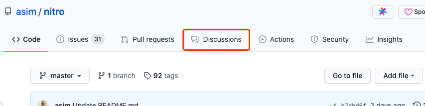
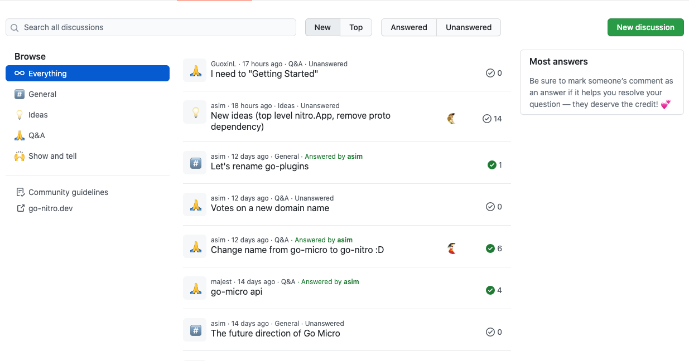
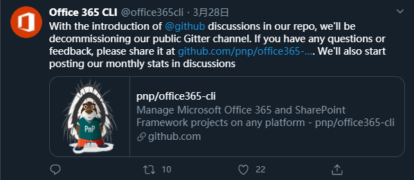

大家好，我是站长 polarisxu。

为了更有利于开源项目的发展，形成自己的社区很重要，作者们可以更好地和使用者交流互动，了解他们需求、问题。虽然 GitHub 有 issue，但毕竟它主要还是用于反馈 bug、提新特性，不是一个社区的感觉。所以一般项目都会有其他的社区，比如会开通 google groups 邮件组、使用 Gitter、Discord、Slack 等。当然，国内的项目通常会使用 QQ 群、微信群。（我个人认为，QQ 群、微信群对社区沉淀是很不好的，知识输出、讨论没法重用，虽然对提问者友好，可以快速得到回应）

今年年初，GitHub 开始测试一个新功能：Discussions，它想为开源项目打造一个自己的社区，将之前分散的社区聚合在一起。比如一般开源社区是这样的：用 Gitter 作为开源社区聊天的地方，StackOverflow 用于寻求问题的答案，而论坛用于讨论等。有了 Discussions，我们可以在上面开展很多活动。GitHub 官方对 Discussions 的描述是这样的：

> This is a community we build together. Please be welcoming and open minded.

不过目前该功能还在公测中，具体正式发布时间还未知。如果你想自己的项目试用该功能，可以到 <https://github.com/github/feedback/discussions> 这里去提出申请，请求 GitHub 将你的项目加入 Beta 列表中。这里有别人请求加入的交流：<https://github.com/github/feedback/discussions/24>。

## 01 一睹 Discussions

我们通过一个开通了该功能的 [Go 项目：Nitro](https://github.com/asim/nitro)（之前的 go-micro，[具体详见该文](https://polarisxu.studygolang.com/posts/go/micro/micro-3.0.0-m3o/)）来看看 Discussions。

在启用了 Discussions 的项目上，在顶部会有这个 Tab：

这个功能应该可以通过 Settings 控制是否启用（在有该功能测试资格的情况下）。

进入该 Tab，页面如下：

左侧可以有分类，中间是主题列表，右侧可以有其他一些提示信息。顶部还可以通过 New、Top、Answered、Unanswered 快速筛选，当然也支持搜索。

## 02 Discussions V.S Issues

以前，Issues 也常常被用来讨论一些与当前 GitHub 项目相关的问题，但实际上可能 Issues 不太适合作为一个问答的地方，更多应该是反馈 bug 等？！现在有了 Discussions，可以对二者的定位做一个划分：Issues 用来反馈 bug，提出新特性；Discussions 用来讨论其他与项目相关的，当然，它也可以用来讨论新特性。在新特性这一点上，我个人认为 Discussions 适合于新特性不成熟的讨论阶段，基本确认后，通过 issue 提交该新特性，实现后 PR 关闭该 issue。

## 03 你看好该功能吗？

从该功能看，GitHub 希望为开源项目提供全套的服务？将相关信息聚合在一起，更有利于形成开源项目自己的社区，我个人挺看好它的。你觉得该功能怎么样？

在 2020 年 3 月 28 日，Offer 365 CLI 就在 Twitter 上宣布，他们将关闭公共 Gitter 频道，开始使用 GitHub Discussions 发布相关信息。

现在看看它的 Discussions 页面，维护的还不错：<https://github.com/pnp/cli-microsoft365/discussions>。

