大家好，我是站长 polarisxu。

2021 年计划聊一些微信公众号的事情。今天先聊聊微信公众号（订阅号）的一些变化，作为这个系列的开篇。

## 01 基础知识

先简单普及一些基础知识：订阅号和服务号，主要介绍下它们关键的一些不同点，着重介绍下订阅号的一些知识。

### 订阅号

如果你开通自己的公众号，一定是选择订阅号。个人主体只能注册订阅号，目前一个身份证只能注册一个订阅号（以前是 5 个）。

**关于认证**

个人订阅号无法进行微信认证。前段时间微信灰度了个人认证，也就是下面这样：

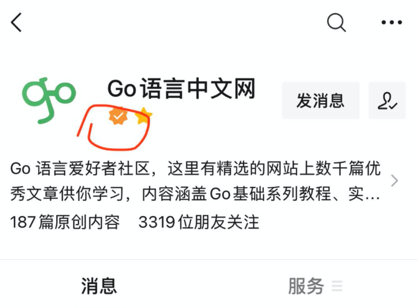

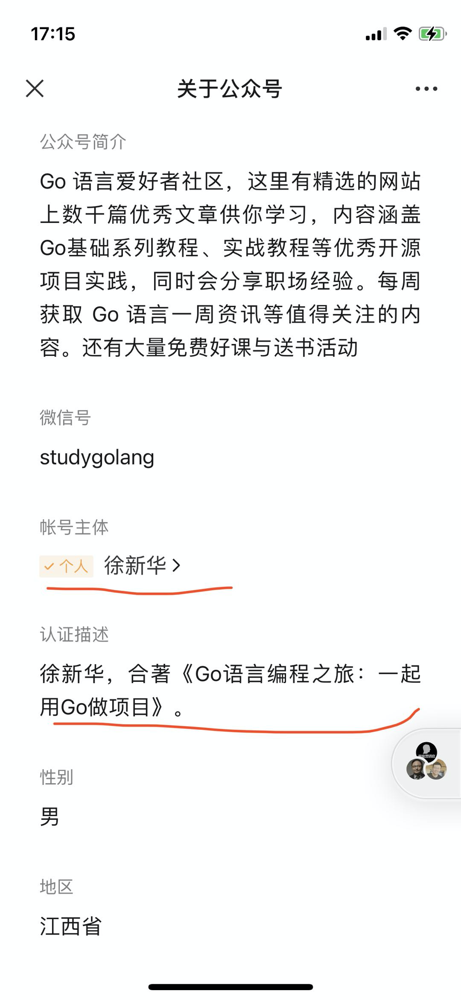

不过目前这个认证没有任何额外的功能，只是一个标识。

而企业（包括个体户）订阅号是支持微信认证的（一次 300 元，一年要认证一次）。认证了的企业订阅号，支持更多的接口功能，进行一些额外开发对接。同时，服务号只能企业注册，认证费用 300/次，一年一次。服务号可以开通微信支付。当然，服务号还有更多其他的能力。

> 因为新注册公众号没有留言功能，如果你想购买，个人订阅号是不行的，必须是注册的企业订阅号，因为被迁移主体必须是认证的企业订阅号。具体这方面有疑问可以和我沟通，我这个号就是迁移得来的。

**关于群发消息**

订阅号每天可以发送一次，每次条数不限制。服务号一个月可以发送 4 次，每次条数也不限制，为什么服务号一个月才能发送 4 次？下面你就会知道。

---

在微信聊天列表，有一个订阅号消息，所有的订阅号（个人和非个人）都会在这里面；而服务号是在外面的，和普通好友聊天同级。比如「西贝莜面村」就是服务号。

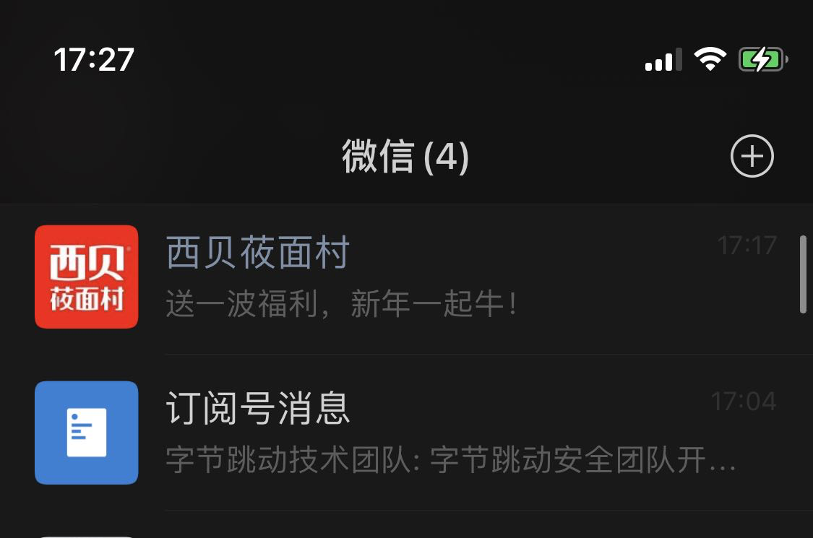

正因为直接在消息列表中，因此微信限制了服务号一个月只能群发 4 次消息，避免恶意打扰用户。毕竟服务号的定位是提供功能服务，不是群发消息，比如提供下单服务。

## 02 列表页的变化

细心的读者会发现，订阅号消息列表页最近有一些变化。

> 有些人可能没留意，一个公众号的一次群发消息（不管多少篇文章）在订阅号消息列表中最多只会显示头条和次条，之后的都是折叠的。

### 头条样式

普通用户可能不会注意。以前订阅号消息列表页，各个公众号的消息头条显示样式有两种：

- 样式一：常读公众号的样式

- 样式二：非常读公众号的样式。即不管头条还是非头条，标题和封面都是一样的显示方式。

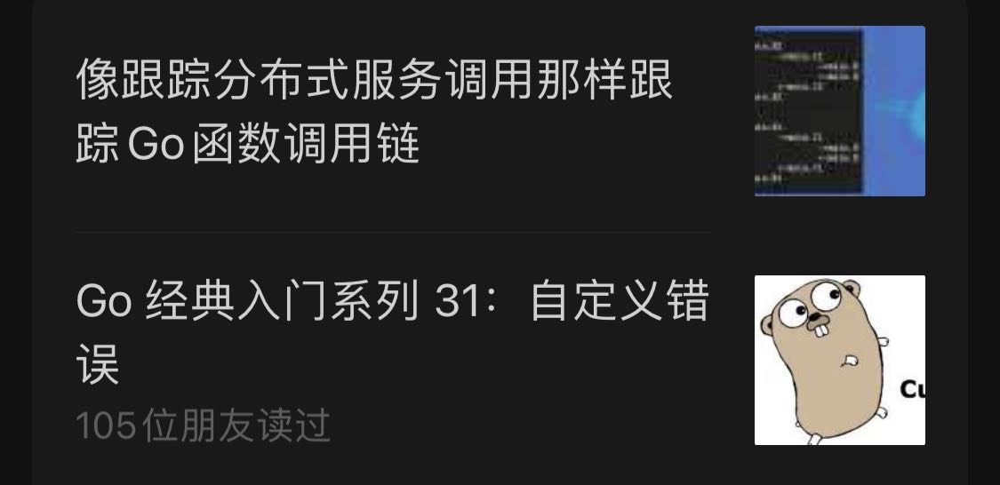

但现在所有的消息都是样式一。不过单篇文章分享出去，封面永远是那个正方形样式。

这样对所有的号公平展示。

### 单条消息样式

有些公众号一次只发送一条消息。之前的样式是这样的：

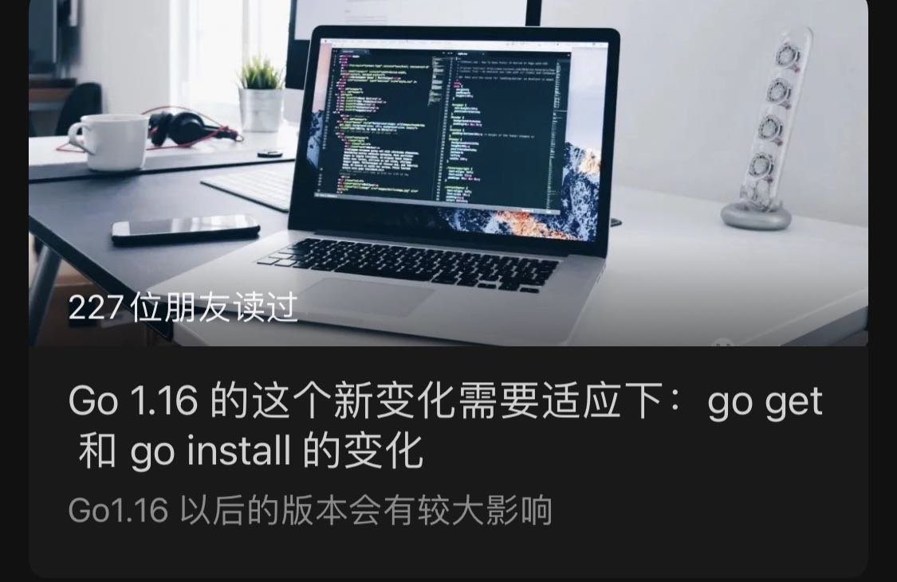

封面、标题和摘要，在标题上方显示多少朋友读过。

现在是这样的：

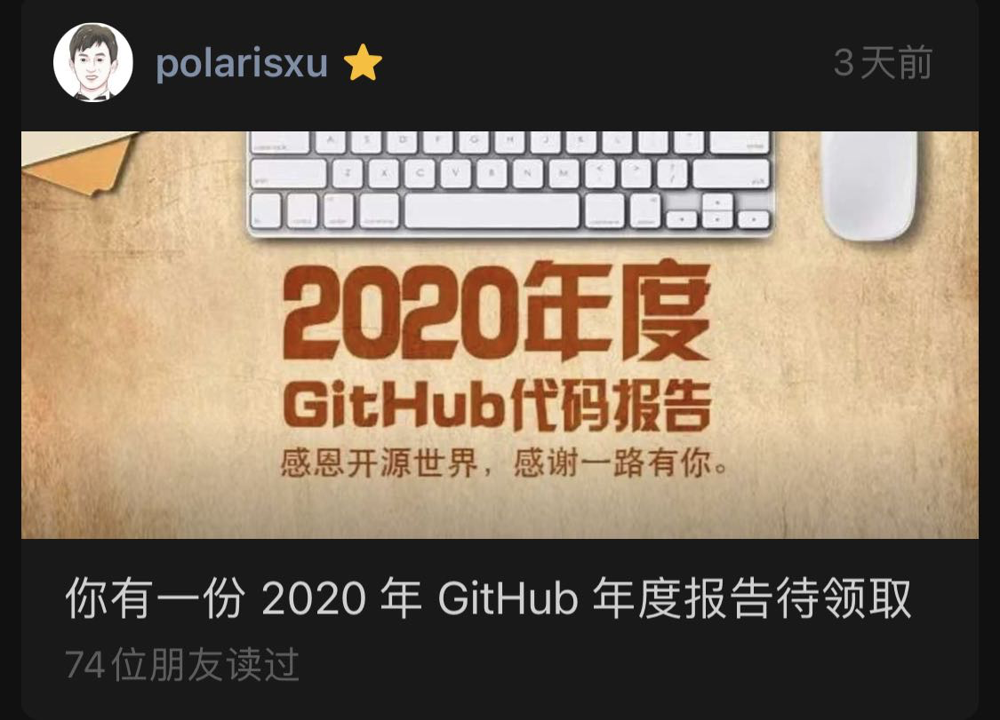

没有了摘要，多少朋友读过放在了摘要那。不过文章分享出去以及进入某个公众号里面看到的，摘要还是有的。

另外，据说有些人被灰度到了这样的样式：

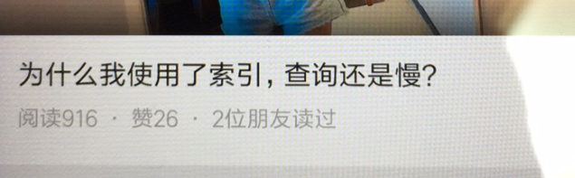

会直接显示阅读数、赞数，也许不显示摘要就是为这个做准备的吧。

> 直接显示阅读数和赞数，靠标题党吸引阅读的，可能效果会比较差了。比如阅读数高，赞少，多半是标题党，用户可能就不点了？！

## 03 公众号主页的变化

没有截以前的图，直接看现在的样子：

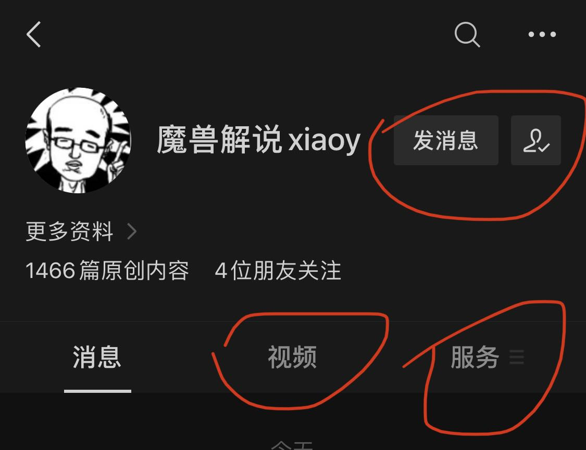

- 增加了视频 Tab。内容是公众号的视频消息（单独群发的视频）。有点鼓励发视频了。比如视频号的视频也发到公众号。（因为我的号没发过视频，所以没有这个 Tab）

- 新增了服务 Tab。将原来的自定义菜单整合到此处，不过 callback 的菜单项不会显示。

- 取消关注位置变了。

另外还有一个，即可将话题标签配置在公众号主页显示，如下图：

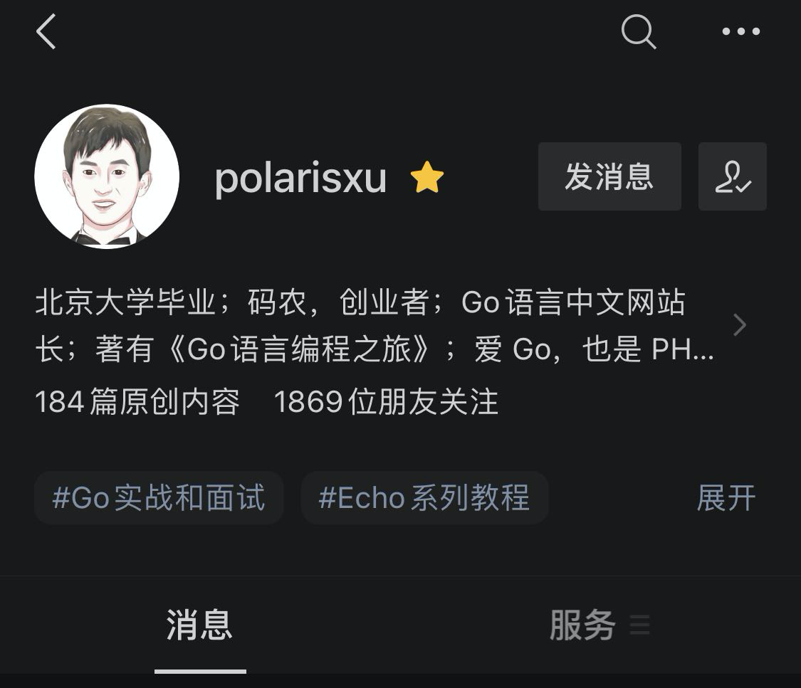

最多可以配置 10 个。具体配置方法：登录 mp.weixin.qq.com，点击左侧 话题标签 菜单进行配置：

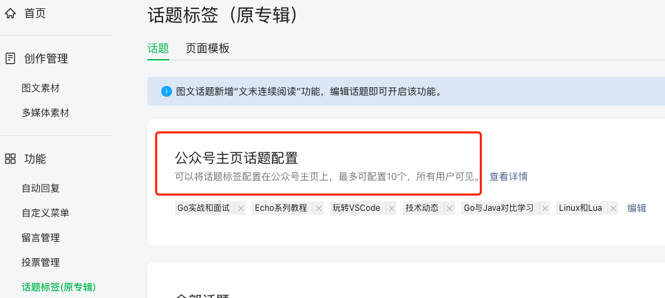

> 微信在话题这个事情上越来越“微博化了”：公众号话题功能、朋友圈和微信群对 `#` 的支持，以及通过话题进行相关查询、推荐等。

## 04 文章详情的变化

平时点赞的朋友应该发现，在公众号文章详情末尾，默认是这样的：

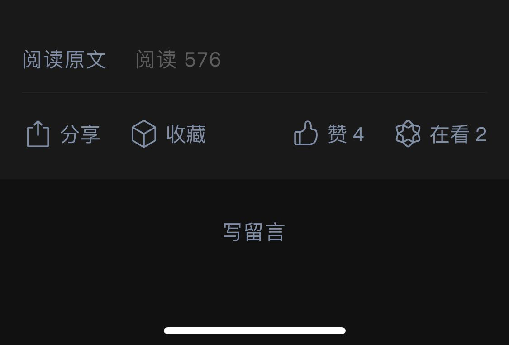

只要你点了“赞”或“在看”，就变成了这样：

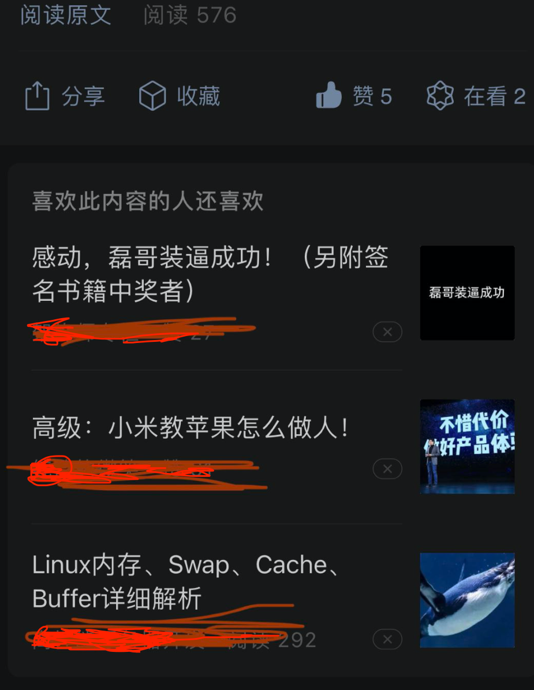

但我真的想说：这个喜欢的推荐我基本都不喜欢，好吗？！推荐给你的，你喜欢吗？

## 05 总结

以上就是近期我发现的一些微信公众号的变化。有些已经存在不短时间了，有些刚上线，很多人还没用上，而有些可能还在灰度测试中。希望本文对你有帮助，特别是还没设置主页标签的，可以设置一波了。