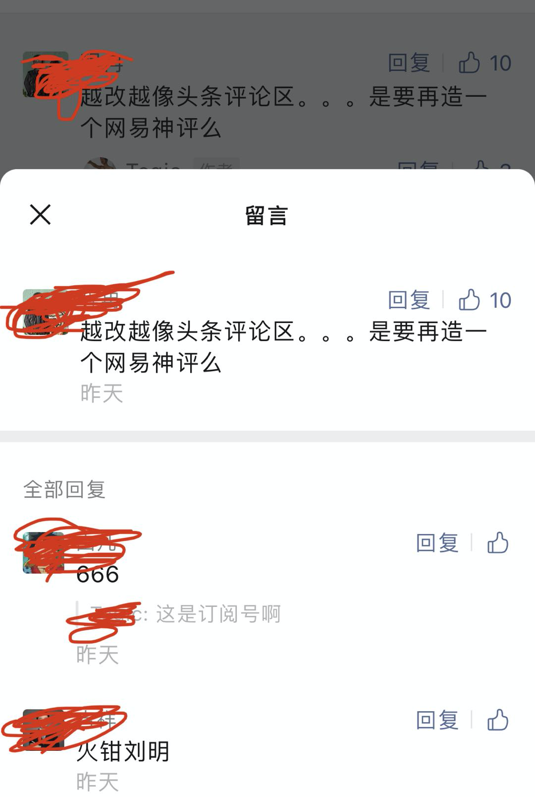
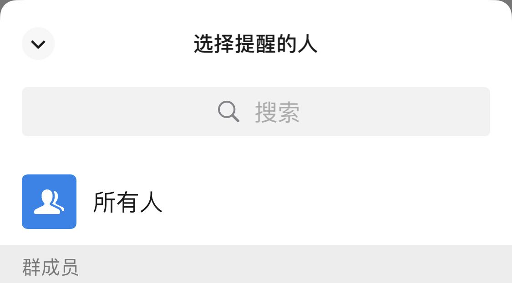

大家好，我是站长 polarisxu。

微信生态近期又有一些不错的变更，体验上有较大改进，我把看到的一些列举下。

## 01 公众号留言支持盖楼

什么意思？最开始，微信公众号的留言，作者回复后，留言者没法接着原来的留言盖楼，必须另起一个留言，前段时间做了改进。不过还存在这样一个问题：比如一楼问了一个问题，其他读者想回复他，没法直接回复，经常见到这样的：回复一楼。然而，微信留言目前的排序是按点赞数，按时间排序，一楼有可能不是一楼了，而且别的读者回复了，留言者也不会有提醒。

现在公众号在灰度测试完全盖楼功能，解决上面说到的问题，体验会更好。

这有种网易评论的感觉，相信公众号留言会更火。不过，任何留言都需要作者精选才能放出来，这也是安全性考虑。

目前我的号还不支持盖楼，支持盖楼是这样子的（点开后）：

## 02 公众号二维码转卡片

前段时间，公众号提供了一个插入公众号卡片的功能，不过卡片是不能复制的，而二维码方便复制。现在公众号编辑后台提供了一个功能，鼠标停留在公众号二维码上，会出现「转为公众号卡片」的字样，点击就可以转为公众号卡片，很贴心的小功能。

## 03 新好友打标签更方便

对于每天要处理较多微信好友请求的人来说，这个改进减少了好几步操作。一般地，为了方便管理为微信好友，会为好友打上标签，毕竟微信不像 QQ，支持好友分组。之前，通过一个好友请求，需要额外点击几步才能设置上标签，现在在好友通过页面直接放上了标签，可以一次性搞定。

## 04 群更方便 @ 所有人

QQ 群 @ 所有人特别方便，但微信群一直很弱，群主想要 @ 所有人，必须通过群公告的形式发布。不过，现在可以直接 @ 所有人了。当然，这个功能比较打扰，建议一般别用，毕竟群主要用于交流，频繁打扰大家不合适。别被群主玩坏了。

输入 @ 会出现下面的对话框，可以选择所有人：

此外还有一个比较有意思的改动，如果你的很好友同时也是你的手机通讯录好友，昵称（或备注名称）和通讯录里的不一致，在转发信息等给他时，名称后会有括号，里面是通讯录中的名称。通过这种方式可以快速的知道，某个好友是不是你手机通讯录好友。（在微信「通讯录」Tab 也是这种方式显示的）

另外，「我的」状态按钮改动多次后，终于好看些了。现在状态旁边加了三个点，可以查看哪些好友有状态，因为状态发布后几天会自动消失。

---

最后介绍两个腾讯开发的微信小程序，也许用得到。

## 05 腾讯电子签

「腾讯电子签」目前包含两个功能：开收据和签合同。

之前都需要纸质，现在通过这个小程序可以线上处理。这也是腾讯在区块链上的应用，支付宝可能早就有类似的功能了。

按官方介绍，这个是有法律效力的，一方面，要求双方实名认证，有纠纷，可以找到人；另一方面，所有关键信息都上区块链。

这里有官方的介绍：[手写收据太麻烦，下回用微信开！](https://mp.weixin.qq.com/s/nrFxj2kEtDOwaPmGgWW0JQ)

试用小程序：

## 06 微小号

有些人可能听过阿里小号，我办理过一个，但目前阿里小号已经无法再购买了。

小号有什么用呢？我想不用过多介绍。

腾讯最近发布了一个「微小号」微信小程序，一人可以购买两个小号。不过一个号 10 元/月，而且目前只支持联通。相比较来说，阿里小号，不优惠一年才 40 元，优惠才 20 元/年。相比来说，微小号真心贵。如果你真有小号的需求，可以问问你的运营商可不可以办理副卡，可能会比这便宜。

---

微信功能的更新，经常隐藏的很深，除了本文介绍的，你还发现了哪些有意思的更新？！

