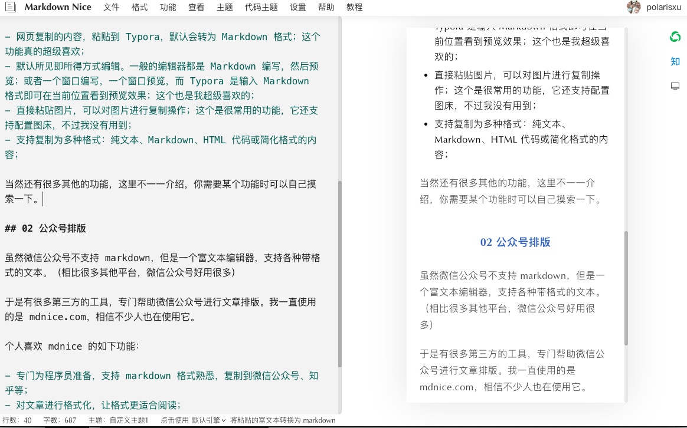

大家好，我是站长 polarisxu。

好吧，这篇文章不是聊美女的，而是聊排版的。让你失望了！

记得高中语文作文，老师总是一再强调，字要工整。如果字迹不清楚，看起来很费劲，即使内容很好，阅卷老师可能也没耐心读，给人的印象就很不好。

现在我们在网络上写文章，同样存在“字要工整”的问题，这就是排版。现在受欢迎的软件，一个个颜值都很高。我们的文章，也必须是高颜值。本文就介绍一些“高颜值”文章的基本工具和排版小建议。

## 01 Mardown 和 Typora

Markdown 几乎成了标准，出版社都支持使用 Markdown 进行图书撰写。所以，如果你还不会 Markdown，一定简单学习下，这里有一个极简的教程：<https://studygolang.com/markdown>。

目前，日常写作，我全部使用的 Markdown。关于 Markdown 的编辑器有很多，我个人一直使用 Typora，很不错，因此推荐给你。

这款软件有几个功能我认为特别棒：

- 网页复制的内容，粘贴到 Typora，默认会转为 Markdown 格式，包括代码，一般都能正确转换；这个功能真的超级喜欢；
- 默认所见即所得方式编辑。一般的编辑器都是 Markdown 编写，然后预览；或者一个窗口编写，一个窗口预览，而 Typora 是输入 Markdown 格式即可在当前位置看到预览效果；这个也是我超级喜欢的；
- 直接粘贴图片，可以对图片进行复制操作（即使是网络图片也可以复制到本地）；这个是很常用的功能，它还支持配置图床，不过我没有用到；
- 支持复制为多种格式：纯文本、Markdown、HTML 代码或简化格式的内容，方便粘贴到其他地方；

当然还有很多其他的功能，这里不一一介绍，你需要某个功能时可以自己摸索一下。

## 02 公众号排版

虽然微信公众号不支持 markdown，但它是一个富文本编辑器，支持各种带格式的文本。（相比很多其他平台，微信公众号好用很多）

于是有很多第三方的工具，专门帮助微信公众号进行文章排版。我一直使用的是 mdnice.com，相信不少人也在使用它。

个人喜欢 mdnice 的如下功能：

- 专门为程序员准备，支持 markdown 格式，可以方便将渲染会后的内容复制到微信公众号、知乎等；
- 对文章进行格式化，让格式更适合阅读，比如中英文之间自动加空格等；
- 由于微信公众号不支持外链，支持一键将外链生成为文末「参考资料」；
- 有众多风格主题和代码主题供选择；
- 可以对主题进行自定义：修改 CSS；比如我就将 `#nice` 增加了 padding: 1px；

下图是本文的效果：

关于图片：我一般都是微信公众号里面通过本地上传，而没有使用 mdnice 集成的图床功能，因为即使用了，复制到微信，也是经常粘贴失败。

此外，文章开头，大家都喜欢给一些引导语句，比如关注 xxx，设为星标之类的，看你的喜好了。而文章末尾，可以加上往期推荐，放上公众号二维码做关注引导！关于头尾，微信公众号有模板，可以提前配置好模板，每次发文章时，插入模板，保证内容形式的统一。

## 03 总结

markdown 是新时代必备的技能，大家应该掌握。通过网络写文章，应该考虑读者的阅读体验，把它当做一个产品来经营，给大家输出高质量文章的同时，保证文章的美观，保证阅读体验！

小提示：不知道大家发现没，不像读书时候学到的，段落第一行缩进 2 个字，现在网络上的阅读，都没有缩进的习惯，遇到了缩进的反倒不习惯了。比如 markdown 排版的文章，段落和段落之间会有明显的空行，个人认为比缩进阅读体验更好。所以，建议你别用缩进。

此外，为了阅读体验，可以进行大段落划分，即使没有合适的标题，也可以通过 01、02、03 这样的方式进行划分。

本文的阅读体验如何？欢迎吐槽！

