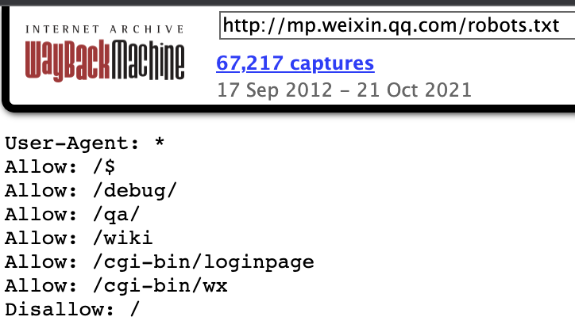
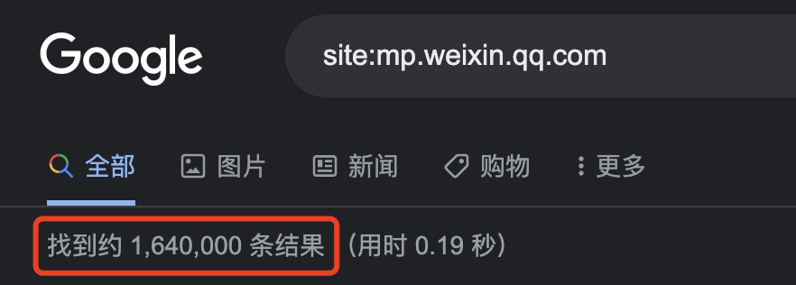
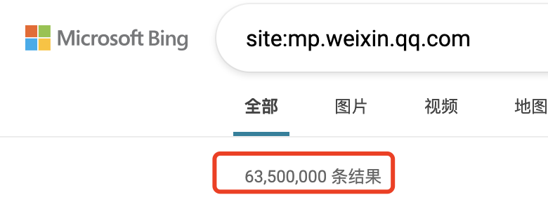
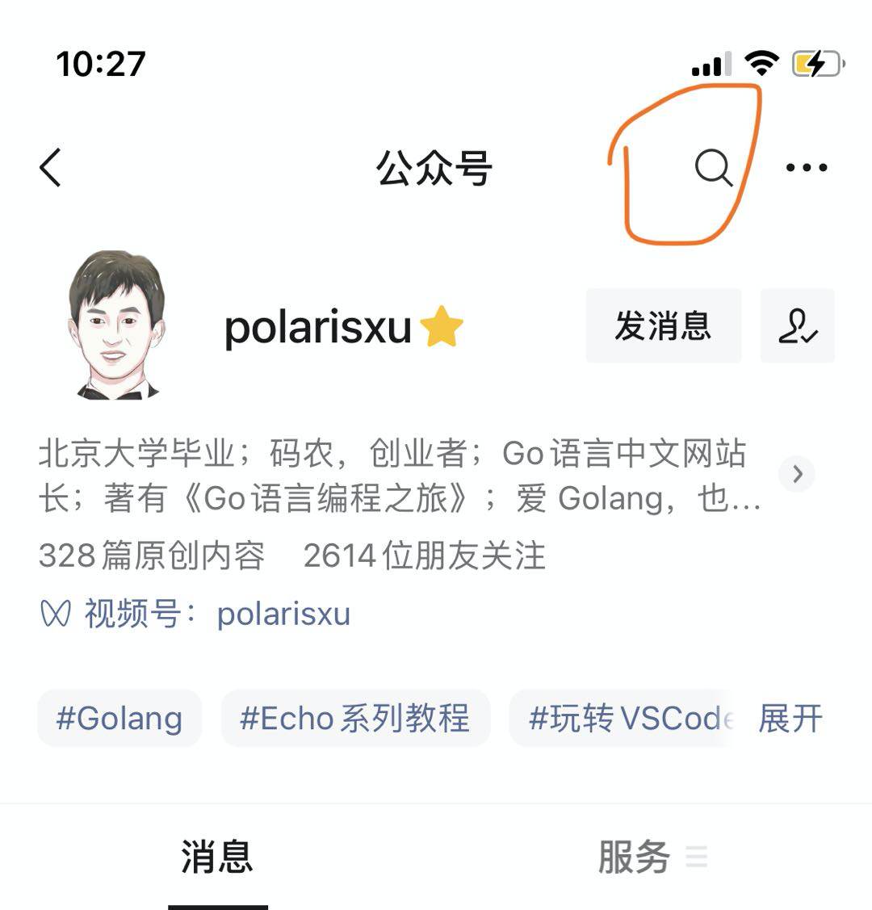
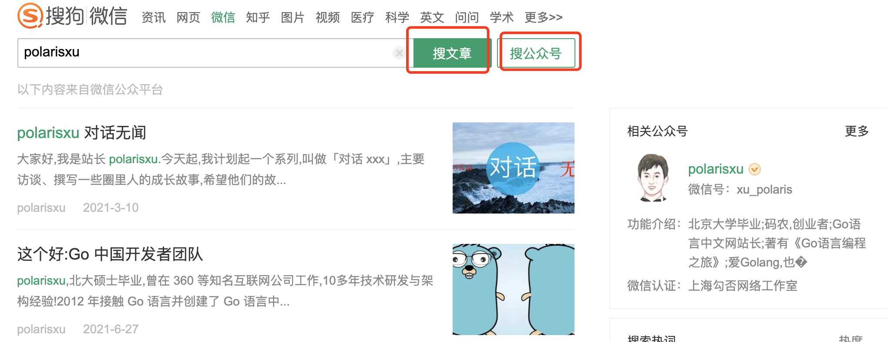
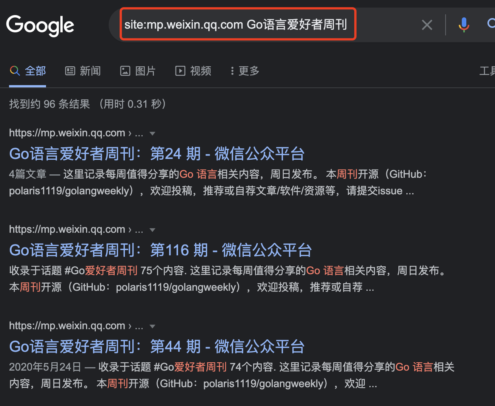

大家好，我是 polarisxu。

搜索引擎一直是查找资料主要的方式，Go语言中文网站点的流量，近 80% 来自搜索引擎。

## 01

然而，微信公众号一直是一个私域，它禁止搜索引擎抓取。最近，各种 zc，大厂做了一些调整。有人发现，微信公众号删除了 robots.txt：

- <https://mp.weixin.qq.com/robots.txt> 内容是空的；

- robots.txt 最近一次内容 <https://web.archive.org/web/20210929115539/mp.weixin.qq.com/robots.txt>

  

所以，现在微信公众号内容可以被搜索引擎抓取了。

实际验证一下：

1）Google

2）Bing

不过，百度目前还是不能搜索，不知道什么原因~

## 02

那么，我们如何更好的找到微信公众号里的 Go 文章呢？

在放开之前，有以下几种方法：

1）微信里面搜索公众号文章。这种方式，大家多少还是有些不习惯，上班时间，大家还是倾向于通过 PC 浏览器搜索。

如果想要搜索某个公众号内的文章，可以手机进入该公众号首页，顶部会有搜索按钮：

2）PC 浏览器，通过搜狗的微信搜索。一直以来，PC 上唯一能搜索微信公众号内容的只有搜狗，因为是自己人，单独给开放的接口。

3）微信公众号放开搜索后，现在通过 Bing、Google 可以正常搜索到公众号内容了。

也可以输入某个公众号名称，搜索这个公众号下面的所有文章。如果你喜欢百度，暂时还没法搜索。

随着权重越来越高，将来大概率搜索时不需要增加 `site:mp.weixin.qq.com` 前缀也能得到不错的结果。

## 03

这个改变会带来什么影响？以下是我的一些思考。欢迎交流！

对于普通用户来说，就是搜索微信公众号内容更方便了，上文已经讲了。

对于一些站点来说，比如抓取、收录微信公众内容，会更方便。

这里我想着重谈谈对公众号号主的影响。

公众号文章，一直被认为是快餐式的，没有沉淀，因为历史文章基本很少有人再看到了。但现在允许抓取，会不断有新的流量。

针对这样的流量，如何转化为自己的粉丝，是最重要的事情。

目前 PC 上打开微信公众号文章，右侧会展示该文章所属公众号的二维码。就这个，我认为不太够。我们应该自己增加引导用户关注。

一般地，大家会在文章底部放上公众号二维码，但后来公众号允许直接插入公众号卡片，点击直接进入公众号首页，方便用户关注。但要知道，这个卡片只在微信内部可点，非微信内部是无法点击打开的。所以，我个人认为，应该始终使用二维码，而不是卡片。

此外，非微信内部打开文章，文章阅读数是不会增加的，而且也看不到留言。因此，可以在二维码处加上类似这样的引导语：觉得文章不错或有疑问，可以微信扫码关注「polarisxu」，和作者交流或查看该文的留言。

你有其他更好的引流方法吗？欢迎留言交流！

另外，为了搜索引擎更好的索引你的微信公众号文章，建议每篇文章都加上往期推荐；此外可以定期发布汇总性的文章，相当于给搜索引擎提供一个 sitemap，让它更快的爬取你更多的文章。