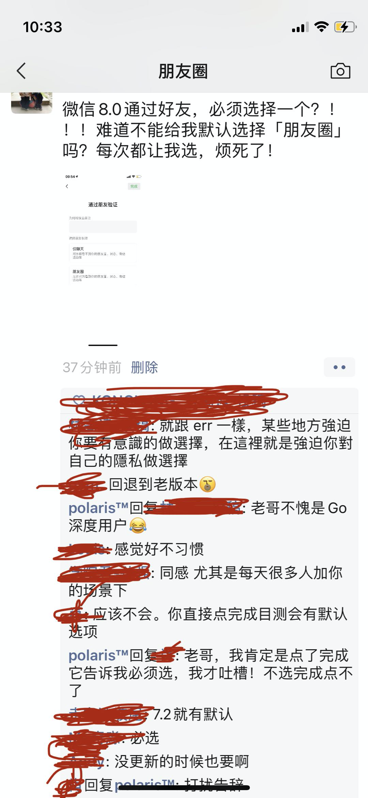
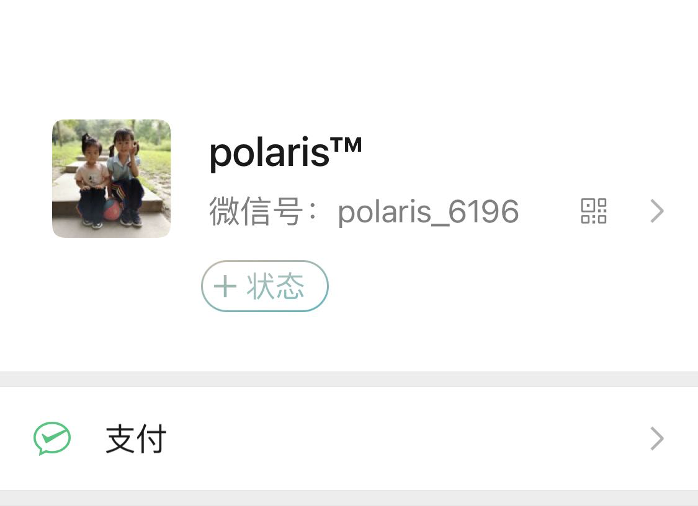
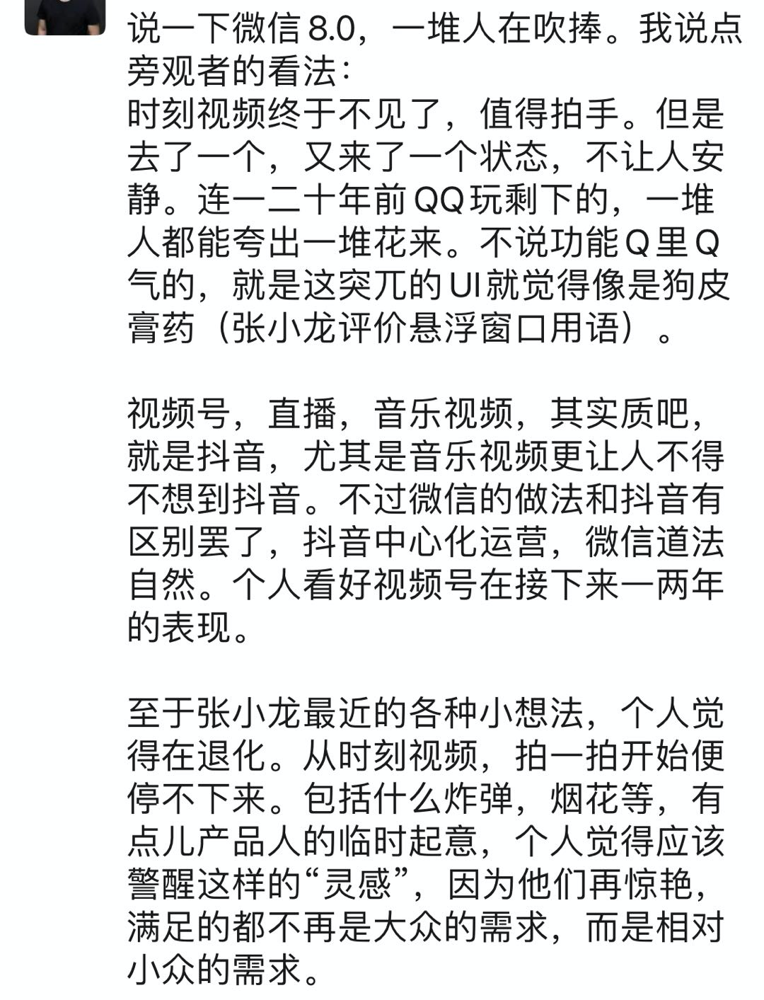

大家好，我是站长 polarisxu。

今天早上发了一个朋友圈，吐槽了一下微信 8.0 的一个功能，不少人有同感，其中一位朋友提到了 Go 的 error。



- 微信 8.0 通过好友请求时，仅聊天还是朋友圈，你必须选择一个。挺烦的。有一个朋友留言说：这就跟 err 一样，某些地方强迫你有意识的做选择，在这里就是强迫你对自己的隐私做选择。

Go 中的 error，社区的反应特别的激烈，喜欢的人夸，不喜欢的人喷，出现了两级分化。就像这位朋友说的，Go 希望开发者明确知晓有可能有错误发生。Go 的初衷也许是好的，但这也导致了代码中经常出现这样的情况：

```go
x, err := foo()
if err != nil {
	return err
}

y, err := bar(x)
if err != nil {
	return err
}

z, err := baz(y)
if err != nil {
	return err
}
...
```

这样的代码必然会遭到很多人吐槽！据说 Go2.0 对错误处理会重新考虑，但 2.0 到现在也只是一个“概念”，虽知道哪天会来~

回到微信 8.0，虽然不是专业产品经理，对产品知识略晓皮毛，但作为用户还是想吐槽下。

微信 8.0 的发布，加上微信 10 周年公开课，网上各种解读、好评。这样的话也许大家也见过：

> 我相信又有很多人要教龙哥做产品了。。。

作为一个用户，我觉得不是教龙哥做产品，而是反馈下使用体验，不一定对，但却是真实使用感受！

读高中时经常调侃一句话：

> 名人说的话是名言，凡人说的话是废话

的确如此，人家之所以是名人，那是人家的本事，能成为名人必然有其不寻常之处。

达利欧在《原则》一书提到「可信度加权」：对那些能力更强的决策者的观点赋予更大的权重，给予更多的重视。大白话说就是成功的人士、成功的产品自带光环，做什么都很香，毕竟他们之前做的都很好，这次大概率做的也是很好的。听起来确实没毛病！

但马克思告诉我们要辩证的看待问题。我用的不爽，就不能认为它做的不好？

有人要说，这个很小众，毕竟大部人处理好友的请求数量很少，偶尔要处理让他们明确选择，对隐私进行保护。但我想说的是，这些好友很少的人，大概率加的好友都是真的好友，又有多少会不让看朋友圈呢？而对于有较多好友请求要处理的人来说，情况很糟糕！有些人可能不知道，微信 8.0 之前，微信好友中，最多有 5000 人可以看到朋友圈，超过 5000，再有人加你好友，微信会提示，然后自动选择仅聊天，因为之前好友是默认可以看朋友圈的。

现在放开了 5000 人的限制。你看，5000 人好友，这个需求难道就不小众，微信却考虑到了，满足了！而且，这么牛逼的产品，追求极致应该是必然的，小众需求也会有所考虑：**毕竟微信的理念是简单，你需要它才出现**。

因此，对于这个功能，我的一些不一定成熟的看法：

- 处理好友请求很少的人，可以统计他们有多少会选择仅好友？我猜测大部分人都会选择朋友圈；
- 微信的渗透很强，很多农村老人都用，他们能理解「仅聊天」、「朋友圈」？求求你让我方便的加上一个好友吧；
- 好友超过 5000 的人，大概率新加好友也会很多，每个好友请求都要操作这么多步，真的好累！

我这里预测，该功能会改进。要么回到之前，默认「朋友圈」；要么做到个性化，根据不同人群的习惯，给一个不同的默认选项。比如每次加好友的选择；是否从来不看朋友圈，设置关闭了朋友圈；是否从来不发朋友圈等等。

另外 8.0 还有一个功能：状态。功能本身我不说，但这个入口按钮的位置，给我一种感觉：要加一个状态的功能，入口放哪好呢？随便找一个显眼的位置放一下吧！总感觉特别突兀~



看到我一个朋友也发了一条朋友圈吐槽，UI 像狗皮膏药。。。



之前的悬浮窗口，8.0 改掉了，龙哥就评价说悬浮窗口像狗皮膏药，你看，微信的设计也不可能全部是完美的。

我没有能力教龙哥做产品，但就像 Go 社区对 error 不满意一样发声，作为微信用户，不爽的地方也是可以发声的。发表自己的意见，不一定对，但也是提升自己思考能力的机会！