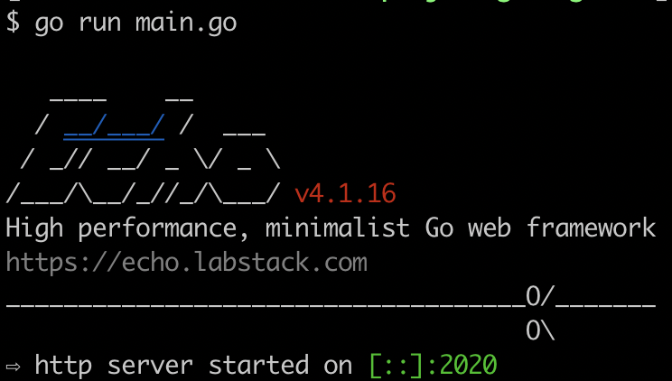

# 基础篇1：搭建 Echo 开发环境

工欲善其事必先利其器。我们先搞定 Echo 环境。

## Go 开发环境

这个系列基于 Go1.14.4，Linux 系统。

安装 Go 的方式有很多，可以在这里 https://studygolang.com/dl 下载对应操作系统的版本。我自己比较喜欢通过源码安装。我将我的方式告诉大家。（Windows 环境比较建议直接下载对应的包进行安装 https://studygolang.com/dl/golang/go1.14.4.windows-amd64.msi）

### 下载源码

在你本地某个目录（比如 $HOME/golang），执行如下命令（确保安装了 git）：

> git clone https://github.com/golang/go

因为 Go 自从 1.5 开始实现了自举，因此要从源码安装 1.5 或以后的版本，必须先有 Go 环境，也就是必须有 Go1.4 或以下版本，这里我们安装 Go1.4。

#### 安装 Go1.4

执行如下命令进行安装：（需要有 root 权限）

```
$ git checkout -b release-branch.go1.4 origin/release-branch.go1.4
$ sudo cp -rf ../go /root/go1.4
$ sudo -s
$ cd /root/go1.4/src
$ ./make.bash
```

验证下 Go1.4 是否安装成功：

```
$ /root/go1.4/bin/go version
```

如果输出版本信息表示成功！

### 安装 Go1.14.4

接下来我们安装 Go1.14.4：（`ctrl + d` 切换回原用户）

```
$ cd ~/golang/go
$ git checkout -b release-branch.go1.14 origin/release-branch.go1.14
$ sudo cp -rf ../go /usr/local/go1.14
$ cd /usr/local/go1.14/src
$ sudo ./make.bash
```

然后我们加上一个软链，这样以后升级版本后，只需要重新设置软链即可：

```
$ sudo ln -s /usr/local/go1.14 /usr/local/go
```

### 配置 Go 环境

最后，将 Go 加入 PATH 中，Linux 中可以在 `/etc/bashrc` 文件最后加上 `export PATH=$PATH:/usr/local/go/bin`。

MacOS 中可以在 `~/.bash_profile` 中加上这行配置。

Windows 下的环境变量配置请自行查找解决，实在有问题可以咨询我！

之后，打开新的 shell，执行 `go env` 可以看到类似如下的输出（Linux 下）：

```
GO111MODULE=""
GOARCH="amd64"
GOBIN=""
GOCACHE="/home/xuxinhua/.cache/go-build"
GOENV="/home/xuxinhua/.config/go/env"
GOEXE=""
GOFLAGS=""
GOHOSTARCH="amd64"
GOHOSTOS="linux"
GONOPROXY=""
GONOSUMDB=""
GOOS="linux"
GOPATH="/home/xuxinhua/go"
GOPRIVATE=""
GOPROXY="https://proxy.golang.org,direct"
GOROOT="/usr/local/go1.14"
GOSUMDB="sum.golang.org"
GOTMPDIR=""
GOTOOLDIR="/usr/local/go1.14/pkg/tool/linux_amd64"
GCCGO="gccgo"
AR="ar"
CC="gcc"
CXX="g++"
CGO_ENABLED="1"
GOMOD=""
CGO_CFLAGS="-g -O2"
CGO_CPPFLAGS=""
CGO_CXXFLAGS="-g -O2"
CGO_FFLAGS="-g -O2"
CGO_LDFLAGS="-g -O2"
PKG_CONFIG="pkg-config"
GOGCCFLAGS="-fPIC -m64 -pthread -fmessage-length=0 -fdebug-prefix-map=/tmp/go-build537145581=/tmp/go-build -gno-record-gcc-switches"
```

为了后续使用的顺畅，我们配置上 goproxy：

```
go env -w GOPROXY=https://goproxy.cn,direct
```

自此，我们的 Go 环境就搞定了！

#### 升级 Go 版本

后续如果要升级 Go，分两种情况。

1）升级到 Go1.14.x，执行如下操作：

```
$ cd ~/golang/go
$ git pull
$ sudo rm -rf /usr/local/go1.14
$ sudo cp -rf ../go /usr/local/go1.14
$ cd /usr/local/go1.14/src
$ ./make.bash
```

2）将来升级到 Go1.15 及后续版本，执行类似如下操作（注意改分支信息和目录）：

```
$ cd ~/golang/go
$ git pull
$ git checkout -b release-branch.go1.15 origin/release-branch.go1.15
$ sudo cp -rf ../go /usr/local/go1.15
$ cd /usr/local/go1.15/src
$ ./make.bash
$ ln -s /usr/local/go1.15 /usr/local/go
```

这样就搞定了！

另外，如果感兴趣也可以使用类似 [gvm](https://github.com/moovweb/gvm) 这样的工具进行 Go 版本管理和切换。

## 开始 Echo

> 官方文档：https://echo.labstack.com/guide
>
> 中文翻译版：http://go-echo.org/

是什么？

> High performance, extensible, minimalist Go web framework

Echo 是一个高性能、可扩展、极简的 Go Web 框架。

### Hello World

所有的练习都在 `~/project/golang/studyecho` 下进行。

```
$ mkdir -p ~/project/golang/studyecho
$ cd ~/project/golang/studyecho
```

接着初始化项目：

```
$ go mod init studyecho
```

这会在当前目录生成 go.mod 文件，内容如下：

```
module studyecho

go 1.14
```

安装 echo（我们使用 4.x.x）：

```
$ go get -u github.com/labstack/echo/v4
```

这会在当前目录生成 `go.sum` 文件，同时修改 `go.mod` 文件。如果你对 Go module 不熟悉，建议阅读 [Go Modules 的使用方法 —— Go 官方博文](https://studygolang.com/articles/19334)。

创建文件 main.go：

```go
package main

import (
	"net/http"
	// 注意这里的路径
	echo "github.com/labstack/echo/v4"
)

func main() {
  // 得到一个 echo.Echo 的实例
	e := echo.New()
  // 注册路由
	e.GET("/", func(c echo.Context) error {
		return c.String(http.StatusOK, "Hello, World!")
	})
  // 开启 HTTP Server
	e.Logger.Fatal(e.Start(":2020"))
}
```

启动服务：

```
$ go run main.go
```

终端输出：



打开浏览器，输入：http://localhost:2020 你会看到：Hello, World!

本节完~

