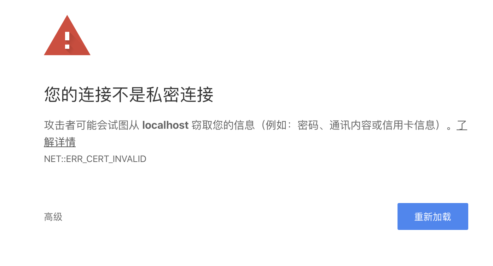

# 定制篇6：自定义 Server 相关，替换或扩展默认的 Server

这是定制篇的最后一节，讲解 Server 的自定义。

## 默认 Server

通常情况下，Echo 通过如下方式启动一个 HTTP Server：

```go
e := echo.New()
e.GET("/", func(c echo.Context) error {
  return c.String(http.StatusOK, "Hello, World!")
})
e.Logger.Fatal(e.Start(":2020"))
```

我们打开源码一探究竟：

```go
// Start starts an HTTP server.
func (e *Echo) Start(address string) error {
	e.Server.Addr = address
	return e.StartServer(e.Server)
}
```

原来调用的是 StartServer，参数是默认的 Server 实例，它是一个 http.Server 的指针类型。

## 自定义 Server

知道了 Echo#Start 最终调用的是 Echo#StartServer，而且它的参数是一个 `*http.Server` 类型，所以自定义一个 Server 很容易。我们先看看 http.Server 这个结构。

```go
type Server struct {
  	// 指定 TCP 的监听地址，形式："host:port"。如果空，则使用 ":http"，即 80 端口
    Addr string
	
		// 当前服务器的 Handler，如果未设置，使用 http.DefaultServeMux
    Handler Handler

  	// TLS 配置
    TLSConfig *tls.Config

  	// 读取整个 request（包括 body）的最大允许时间（超时时间）
    ReadTimeout time.Duration

  	// 从 Go1.8 开始增加。只是读取请求头的最大允许时间（超时时间）
    ReadHeaderTimeout time.Duration // Go 1.8

  	// 和 ReadTimeout 对应，这是写 response 的最大允许时间（超时时间）
    WriteTimeout time.Duration

  	// 从 Go1.8 开始增加。下个请求到来前允许的最大空闲时间（keep-alive 启用时）。
  	// 如果是 0，使用 ReadTimeout，都为 0 ，不会超时。
    IdleTimeout time.Duration // Go 1.8

  	// 允许的最大请求头（单位字节），默认值 DefaultMaxHeaderBytes
    MaxHeaderBytes int
		
  	// 其他字段忽略。。。
}
```

默认情况下启动的 Server，超时时间是 0，也就是不会超时。我们自定义一个 Server，设置超时时间：

```go
s := &http.Server{
  Addr:         ":2020",
  ReadTimeout:  10 * time.Second,
  WriteTimeout: 10 * time.Second,
}
e.Logger.Fatal(e.StartServer(s))
```

为了方便验证，我们将超时时间设置的较短：10s，实际项目这个肯定太短了。


### 验证读超时是否生效

往下看之前，你想想用什么办法可以验证？

因为 HTTP 是基于 TCP 的，我们可以简单的通过建立 TCP 连接，然后等待一段时间后，再发送 HTTP 报文，具体代码如下：

```go
func main() {
	conn, err := net.Dial("tcp", "127.0.0.1:2020")
	if err != nil {
		panic(err)
	}
	time.Sleep(11 * time.Second)
	fmt.Fprintf(conn, "GET / HTTP/1.0\r\n\r\n")
	status, err := bufio.NewReader(conn).ReadString('\n')
	fmt.Println(status, err)
}
```

通过修改 Sleep 的时间来控制等待时间，可以看看 10s 以内是否成功（刚好 10s 可能也会失败），10s 以上又是什么情况。

> 注意，这里的 HTTP/1.0 不能改为 1.1 等，否则得提供 Host 头部

Sleep 设置为 11s ，运行客户端后，如果返回 EOF，则表明超时设置生效了。

## 自定义 Listener

Echo 框架支持自定义 Listener，即通过 `Echo#Listener` 进行设置。例如：

```go
l, err := net.Listen("tcp", ":1323")
if err != nil {
  e.Logger.Fatal(l)
}
e.Listener = l
e.Logger.Fatal(e.Start(""))
```

什么场景下会需要自定义？或者说为什么 Echo 要让用户可以自定义 Listener？我认为有两种考虑：

1. Listener 支持配置，具体就是 net.ListenConfig 类型。实际上，net 包中，net.Listen() 函数就是用了这个类型获取 Listener 实例；

2. 除了使用 net.Listen 获取一个 Listener 接口的实例外，还有其他的方式可以获取 Listener 接口的实例；

### UnixListener

我们着重看看第 2 种情况。

net.Listener 是一个接口。在 net 库中，有 TCPListener 和 UnixListener，除此之外，其他的 Listener 都是基于这两种。比如 net.FileListener() 函数，最终是 TCPListener。

一般我们使用的就是 TCPListener，如果想在 echo 中使用 UnixListener，如何实现？（这个例子没有太多现实意义）

```go
func main() {
	unixAddr, err := net.ResolveUnixAddr("unix", "/tmp/echo.sock")
	if err != nil {
		panic(err)
	}
	unixListener, err := net.ListenUnix("unix", unixAddr)
	if err != nil {
		panic(err)
	}

	e := echo.New()

	e.GET("/", func(ctx echo.Context) error {
		return ctx.String(http.StatusOK, "Hello Unix！")
	})

	e.Listener = unixListener
	e.Logger.Fatal(e.Start(""))
}
```

因为基于 Unix Domain Socket，所以，没法直接浏览器访问。写一个测试程序：

```go
func main() {
	unixAddr, err := net.ResolveUnixAddr("unix", "/tmp/echo.sock")
	if err != nil {
		panic(err)
	}
	conn, err := net.DialUnix("unix", nil, unixAddr)
	if err != nil {
		panic(err)
	}
	fmt.Fprintf(conn, "GET / HTTP/1.0\r\n\r\n")
	body, err := ioutil.ReadAll(conn)
	if err != nil {
		panic(err)
	}
	defer conn.Close()
	fmt.Println(string(body))
}
```

客户端能够输出：

```bash
HTTP/1.0 200 OK
Content-Type: text/plain; charset=UTF-8
Date: Wed, 25 Mar 2020 06:35:12 GMT
Content-Length: 13

Hello Unix！
```

表示成功！

再提醒下，一般不会定义 Listener，你知晓能定义即可。

## TLS 相关

这里顺便介绍下 Echo 对 TLS 的支持。一般来说是用不到的，因为实际中，我们会使用 Web Server 进行反向代理，由 Web Server 来处理 TLS。但了解相关内容还是有利的。

### HTTPS Server

看下相应的方法签名：

```
func (e *Echo) StartTLS(address string, certFile, keyFile interface{}) (err error)
```

相比 Echo#Start 方法，StartTLS 多了两个参数：certFile 和 keyFile。这两个参数是什么意思？这里简单介绍下，知晓什么意思即可。

- certFile：证书
- keyFile：私钥

net/http 包，这两个参数是字符串，代表两个文件的路径。Echo 对此进行了扩展，除了可以代表文件的路径，还可以是字节数组，表示证书和私钥的具体内容。

CA 证书可以购买，也可以申请免费的（阿里云、七牛云都有），也可以使用 let’s encrypt 免费证书。这里我们先自己生成证书，本地验证。（注意，自己生成的证书，浏览器是不认的）

#### 证书生成

证书的生成可以用 Linux/Mac 的 OpenSSL 工具链。对于一个网站，首先必须有自己的私钥，私钥的生成方式为：

```bash
$ cd go-cache-example # 切换到我们的项目根目录
$ openssl genrsa -out server.key 2048
```

会在当前目录下生成一个 server.key 文件，这就是私钥。

利用私钥就可以生成证书了。OpenSSL 使用 x509 命令生成证书。这里需要区分两个概念：证书（certificate）和证书请求（certificate sign request）

- 证书是自签名或 CA 签名过的凭据，用来进行身份认证
- 证书请求是对签名的请求，需要使用私钥进行签名

x509 命令可以将证书和证书请求相互转换。

从私钥可以生成自签名证书：（跳过了证书请求，一步到位）

```bash
openssl req -new -x509 -key server.key -out server.crt -days 365
```

req 命令会通过命令行要求用户输入国家、地区、组织等信息，这些信息会附加在证书中展示给连接方。

```bash
You are about to be asked to enter information that will be incorporated
into your certificate request.
What you are about to enter is what is called a Distinguished Name or a DN.
There are quite a few fields but you can leave some blank
For some fields there will be a default value,
If you enter '.', the field will be left blank.
-----
Country Name (2 letter code) []:CN
State or Province Name (full name) []:Beijing
Locality Name (eg, city) []:Beijing
Organization Name (eg, company) []:studygolang
Organizational Unit Name (eg, section) []:
Common Name (eg, fully qualified host name) []:localhost
Email Address []:polaris@studygolang.com
```

以上命令会在当前目录生成 server.crt 文件。

这样我们有了上面需要的 cert 和 key。

### 验证本地的 HTTPS Server

在 go-cache-example 项目中的 cmd/custom/main.go 包含如下代码：

```go
func main() {
	e := echo.New()

	e.GET("/", func(ctx echo.Context) error {
		return ctx.String(http.StatusOK, "Hello TLS！")
	})

	e.Logger.Fatal(e.StartTLS(":2020", "server.crt", "server.key"))
}
```

启动服务：go run cmd/custom/main.go

```bash
   ____    __
  / __/___/ /  ___
 / _// __/ _ \/ _ \
/___/\__/_//_/\___/ v4.1.15
High performance, minimalist Go web framework
https://echo.labstack.com
____________________________________O/_______
                                    O\
⇨ https server started on [::]:2020
```

打开 Chrome 浏览器，请求：https://localhost:2020 （注意是 HTTPS），出现如下错误：



在浏览器输出：`chrome://flags/#allow-insecure-localhost` ，高亮的置为 Enabled，Reload Chrome。


再次请求 https://localhost:2020 ，能正常输出：Hello TLS！表明成功了。

通过 FireFox 浏览器，可以方便看到，我们这个服务支持 HTTP/2：


> Echo 还支持自动 TLS，即：Echo#StartAutoTLS 方法，它从 https://letsencrypt.org 获取证书。这涉及到正式域名等，在此不演示！

## 自定义 HTTP/2 Cleartext Server

默认情况下，HTTP/2 是基于 TLS 的。上面也看到，当是 HTTPS Server 时，浏览器支持 HTTP/2，默认使用了它。如果我们想使用 HTTP/2，但是又不想使用 TLS，可以吗？这就是 H2C，即：HTTP/2 Cleartext Server。

从 Echo4.1.15 开始支持启动 H2C 服务器：

```go
func (e *Echo) StartH2CServer(address string, h2s *http2.Server) (err error)
```

Go 从 1.6 开始，标准库 net/http 支持 HTTP/2，Go1.8 支持 HTTP/2 的 Push。Go 对 HTTP/2 的支持，最初通过 golang.org/x/net/http2 包实现。Echo 中，上面方法的参数 http2.Server 就是 golang.org/x/net/http2 包中的。

实现一个支持 H2C 的 HTTP Server：

```go
func main() {
	e := echo.New()

	e.GET("/", func(ctx echo.Context) error {
		fmt.Println(ctx.Request().Proto)
		return ctx.String(http.StatusOK, "Hello HTTP/2！")
	})

	server := &http2.Server{
		MaxConcurrentStreams: 250,
		MaxReadFrameSize:     1048576,
		IdleTimeout:          10 * time.Second,
	}
	e.Logger.Fatal(e.StartH2CServer(":2020", server))
}
```

然而，因为现代的浏览器都不支持  H2C，所以测试我们通过 curl 来进行。

```bash
$ curl -v --http2 -k http://localhost:2020

*   Trying ::1...
* TCP_NODELAY set
* Connected to localhost (::1) port 2020 (#0)
> GET / HTTP/1.1
> Host: localhost:2020
> User-Agent: curl/7.64.1
> Accept: */*
> Connection: Upgrade, HTTP2-Settings
> Upgrade: h2c
> HTTP2-Settings: AAMAAABkAARAAAAAAAIAAAAA
>
< HTTP/1.1 101 Switching Protocols
< Connection: Upgrade
< Upgrade: h2c
* Received 101
* Using HTTP2, server supports multi-use
* Connection state changed (HTTP/2 confirmed)
* Copying HTTP/2 data in stream buffer to connection buffer after upgrade: len=0
* Connection state changed (MAX_CONCURRENT_STREAMS == 250)!
< HTTP/2 200
< content-type: text/plain; charset=UTF-8
< content-length: 15
< date: Thu, 26 Mar 2020 08:20:58 GMT
<
* Connection #0 to host localhost left intact
Hello HTTP/2！* Closing connection 0
```

而且服务端的输出也确实证明是 HTTP/2。

另外可以通过 Echo#DisableHTTP2 禁用 HTTP/2。

至此，关于 Server 的定制就介绍完了。Echo 的定制也全部讲解完。