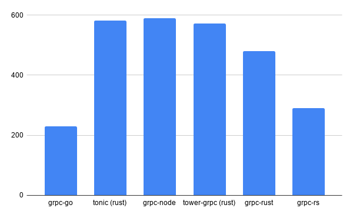
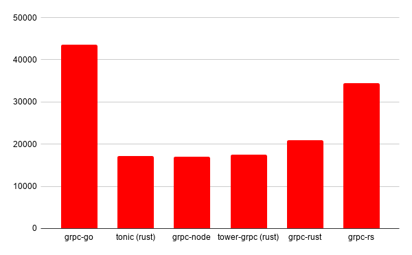

# 对 gRPC 的 Rust 和 Go 版本进行基准测试

## 背景

如果你计划构建可靠，[内存安全](https://blog.gds-gov.tech/appreciating-rust-memory-safety-438301fee097)，高性能的应用程序，那么 Rust＆Go 无疑会是你的选择。

如果您希望从内部应用程序中获得更高的性能，则可能还需要考虑使用 [gRPC](https://grpc.io/docs/what-is-grpc/introduction/) 而不是普通的 [REST](https://restfulapi.net/) API。所有这些都是减少您的计算开销的解决方案。

我尝试比较各种库以了解它们的性能，并希望对你有所帮助。

## 关注的库

- [tower-grpc](https://github.com/tower-rs/tower-grpc) (Rust)

  高性能 rust 库，尽管已被 tonic 替代

- [grpc-go](https://github.com/grpc/grpc-go) (Golang)

  grpc 的官方 Go 模块

- [grpc-rust](https://github.com/stepancheg/grpc-rust) (Rust)

  仍在开发中，另一个 rust grpc 库。看起来很不错

- [tonic](https://github.com/hyperium/tonic) (Rust)

	tower-grpc 库的改进更新，支持新的 await 语法

- [grpc-node](https://github.com/grpc/grpc-node) (NodeJs)

	包含有基准基准点

- [grpc-rs](https://github.com/tikv/grpc-rs) (Rust — C bindings)

	使用 [grpc](https://github.com/grpc/grpc) 的 rust 库

## 基准测试工具

对于基准测试，我将在 gRPC 中使用与 [Hey](https://github.com/rakyll/hey) 等效的 [ghz](https://github.com/bojand/ghz)。

该测试将重点关注如果使用上述每个库将 10,000 个并发请求的相同负载发送到服务器，将有多少开销。我将为每个使用相同的 [helloworld](https://github.com/grpc/grpc-go/blob/master/examples/helloworld/helloworld/helloworld.proto) greeter。不会为任何测试启用 TLS，因此我们可以大致了解每种测试的原始性能。

### grpc-go

```bash
Summary:
  Count: 10000
  Total: 229.40 ms
  Slowest: 6.26 ms
  Fastest: 0.11 ms
  Average: 1.04 ms
  Requests/sec: 43591.54Response time histogram:
  0.114 [1]    |
  0.728 [3355] |∎∎∎∎∎∎∎∎∎∎∎∎∎∎∎∎∎∎∎∎∎∎∎∎∎∎∎∎∎
  1.343 [4580] |∎∎∎∎∎∎∎∎∎∎∎∎∎∎∎∎∎∎∎∎∎∎∎∎∎∎∎∎∎∎∎∎∎∎∎∎∎∎∎∎
  1.957 [1519] |∎∎∎∎∎∎∎∎∎∎∎∎∎
  2.572 [294]  |∎∎∎
  3.187 [36]   |
  3.801 [11]   |
  4.416 [74]   |∎
  5.030 [52]   |
  5.645 [45]   |
  6.259 [33]   |Latency distribution:
  10 % in 0.46 ms
  25 % in 0.64 ms
  50 % in 0.88 ms
  75 % in 1.24 ms
  90 % in 1.68 ms
  95 % in 2.00 ms
  99 % in 4.77 msStatus code distribution:
  [OK]   10000 responses
```

### tonic

```bash
Summary:
  Count: 10000
  Total: 581.81 ms
  Slowest: 6.39 ms
  Fastest: 0.17 ms
  Average: 2.84 ms
  Requests/sec: 17187.66Response time histogram:
  0.174 [1]    |
  0.796 [5]    |
  1.418 [6]    |
  2.040 [167]  |∎
  2.662 [3427] |∎∎∎∎∎∎∎∎∎∎∎∎∎∎∎∎∎∎∎∎∎∎∎∎∎∎∎
  3.284 [5074] |∎∎∎∎∎∎∎∎∎∎∎∎∎∎∎∎∎∎∎∎∎∎∎∎∎∎∎∎∎∎∎∎∎∎∎∎∎∎∎∎
  3.906 [1048] |∎∎∎∎∎∎∎∎
  4.528 [217]  |∎∎
  5.150 [29]   |
  5.773 [21]   |
  6.395 [5]    |Latency distribution:
  10 % in 2.35 ms
  25 % in 2.55 ms
  50 % in 2.79 ms
  75 % in 3.07 ms
  90 % in 3.39 ms
  95 % in 3.66 ms
  99 % in 4.22 msStatus code distribution:
  [OK]   10000 responses
```

### grpc-node

```bash
Summary:
  Count: 10000
  Total: 589.25 ms
  Slowest: 12.56 ms
  Fastest: 1.21 ms
  Average: 2.88 ms
  Requests/sec: 16970.81Response time histogram:
  1.206 [1]    |
  2.341 [2592] |∎∎∎∎∎∎∎∎∎∎∎∎∎∎∎∎∎∎∎
  3.476 [5516] |∎∎∎∎∎∎∎∎∎∎∎∎∎∎∎∎∎∎∎∎∎∎∎∎∎∎∎∎∎∎∎∎∎∎∎∎∎∎∎∎
  4.612 [1588] |∎∎∎∎∎∎∎∎∎∎∎∎
  5.747 [180]  |∎
  6.882 [42]   |
  8.017 [32]   |
  9.152 [5]    |
  10.288 [20]  |
  11.423 [6]   |
  12.558 [18]  |Latency distribution:
  10 % in 2.14 ms
  25 % in 2.33 ms
  50 % in 2.62 ms
  75 % in 3.24 ms
  90 % in 3.85 ms
  95 % in 4.26 ms
  99 % in 6.41 msStatus code distribution:
  [OK]   10000 responses
```

### tower-grpc

```bash
Summary:
  Count: 10000
  Total: 571.88 ms
  Slowest: 10.59 ms
  Fastest: 0.25 ms
  Average: 2.76 ms
  Requests/sec: 17486.12Response time histogram:
  0.246 [1]    |
  1.280 [139]  |∎
  2.314 [2927] |∎∎∎∎∎∎∎∎∎∎∎∎∎∎∎∎∎∎∎∎∎∎∎
  3.348 [5198] |∎∎∎∎∎∎∎∎∎∎∎∎∎∎∎∎∎∎∎∎∎∎∎∎∎∎∎∎∎∎∎∎∎∎∎∎∎∎∎∎
  4.382 [1390] |∎∎∎∎∎∎∎∎∎∎∎
  5.416 [114]  |∎
  6.450 [61]   |
  7.484 [80]   |∎
  8.518 [47]   |
  9.552 [31]   |
  10.586 [12]  |Latency distribution:
  10 % in 1.80 ms
  25 % in 2.20 ms
  50 % in 2.65 ms
  75 % in 3.13 ms
  90 % in 3.64 ms
  95 % in 4.05 ms
  99 % in 7.18 msStatus code distribution:
  [OK]   10000 responses
```

### grpc-rust

```bash
Summary:
  Count: 10000
  Total: 479.30 ms
  Slowest: 8.15 ms
  Fastest: 0.90 ms
  Average: 2.34 ms
  Requests/sec: 20863.64Response time histogram:
  0.901 [1]    |
  1.626 [193]  |∎
  2.351 [5587] |∎∎∎∎∎∎∎∎∎∎∎∎∎∎∎∎∎∎∎∎∎∎∎∎∎∎∎∎∎∎∎∎∎∎∎∎∎∎∎∎
  3.076 [3562] |∎∎∎∎∎∎∎∎∎∎∎∎∎∎∎∎∎∎∎∎∎∎∎∎∎∎
  3.801 [506]  |∎∎∎∎
  4.526 [119]  |∎
  5.251 [16]   |
  5.976 [5]    |
  6.701 [2]    |
  7.426 [2]    |
  8.151 [7]    |Latency distribution:
  10 % in 1.87 ms
  25 % in 2.03 ms
  50 % in 2.25 ms
  75 % in 2.57 ms
  90 % in 2.90 ms
  95 % in 3.23 ms
  99 % in 4.11 msStatus code distribution:
  [OK]   10000 responses
```

### Grpc-rs

```bash
Summary:
  Count: 10000
  Total: 289.82 ms
  Slowest: 4.22 ms
  Fastest: 0.22 ms
  Average: 1.36 ms
  Requests/sec: 34504.74Response time histogram:
  0.222 [1]    |
  0.621 [195]  |∎∎
  1.021 [1829] |∎∎∎∎∎∎∎∎∎∎∎∎∎∎∎∎∎∎
  1.420 [4059] |∎∎∎∎∎∎∎∎∎∎∎∎∎∎∎∎∎∎∎∎∎∎∎∎∎∎∎∎∎∎∎∎∎∎∎∎∎∎∎∎
  1.820 [2625] |∎∎∎∎∎∎∎∎∎∎∎∎∎∎∎∎∎∎∎∎∎∎∎∎∎∎
  2.219 [972]  |∎∎∎∎∎∎∎∎∎∎
  2.618 [239]  |∎∎
  3.018 [45]   |
  3.417 [18]   |
  3.817 [6]    |
  4.216 [11]   |Latency distribution:
  10 % in 0.87 ms
  25 % in 1.07 ms
  50 % in 1.30 ms
  75 % in 1.62 ms
  90 % in 1.90 ms
  95 % in 2.07 ms
  99 % in 2.56 msStatus code distribution:
  [OK]   10000 responses
```

## 汇总概要



总响应时间（以毫秒为单位）。越低越好。



吞吐量（请求/秒）。越高越好。

## 总结

结果表明，在性能方面，rust 与 node 相当，这是一个令人震惊的结果。

Go 库在并发性和最小开销方面均表现出色。

如果有人对 Go 库表现优异有些疑惑，请给留言给出你的看法！

> 原文链接：<https://medium.com/@Rustling_gopher/benchmarking-grpc-in-rust-go-184545e7688a>
>
> 作者：Rustler
>
> 编译：polaris