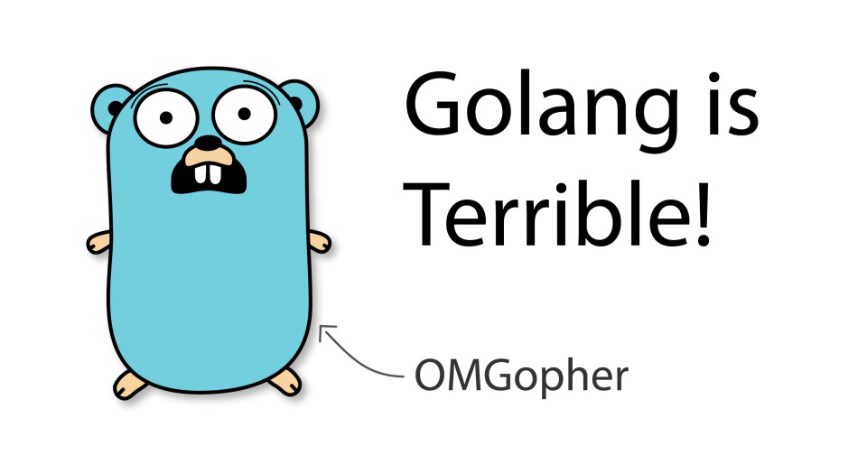

# 从这些角度看 Go 是一门糟糕的语言

> 上篇文章作者讲到了 Go 的优点，这篇文章提到一些缺点。然而，不少内容我是不认可的。欢迎留言说说你的观点。

Go 当前引起了很多关注。让我们看一下 Go 不好的部分。



作为开发人员，如今很难忽视 Go。因为诸如 Docker 和 Kubernetes 之类的软件，它已迅速崛起。但是，如果仅看一下该语言的流行度图表，Go 就与最流行或增长最快的编程语言相去甚远。

为何每个人似乎都在谈论和招聘 Go？从系统级工程到建立网上商店，似乎每个人都想使用 Go？这仅仅是炒作曲线吗，Go 适用于它正在执行的任务吗？

我最近用 Go 写了一个 [SSH 服务器](https://github.com/janoszen/containerssh)，在其中启动容器。该项目已经发展到很大规模，并且我还向 Go [发起了 PR](https://go-review.googlesource.com/c/crypto/+/236517)，以修复我发现的错误。

在本文中，我将介绍一些不好的部分：语言设计的缺陷，Go 需要进一步成熟的部分，甚至是令人讨厌的地方。

但是，这并非完全不好：Go 具有一些很棒的功能，使其成为许多应用程序的宝贵工具。如果您对此感兴趣，请“继续”阅读上篇文章。

让我们看一下令人讨厌的部分。请记住，本文是基于 Go 1.14 撰写的。时间推移，这些可能会改进。

## 错误处理

Go 没有异常。在我看来，尽管对异常有非常有效的批评，但 Go 选择用于处理错误的方法却更加糟糕。

你会看到，在 Go 中可以声明如下的函数：

```go
func doSomething() error {
    return errors.New("this is an error")
}
```

调用此函数时，可以选择处理此错误：

```go
func doSomethingElse() error {
    err := doSomething()
    if err != nil {
        return err
    }
    //More things to do
}
```

这里有很多东西要解释。首先，没有什么可以强制您处理此潜在错误。当然，像 Goland 这样的 IDE 会警告您，但是编译器不会强制您处理此错误。（这个问题也可以通过 linter 来部分缓解，因为 linter 会检查您的源代码是否有类似的意外遗漏。）

更进一步，在 99.9％ 的情况下，错误基本上是字符串。是的，错误是您可以根据需要实现的任何接口，但是我见过的大多数 Go 代码都没有利用此接口来提供类型错误。提供类型错误的标准方法似乎如下：

```go
var MyError = errors.New("this is an error")

func doSomething() error {
    return MyError
}

func doSomethingElse() error {
    err := doSomething()
    if err != nil {
        if err == MyError {
            // Handle MyError specifically
        } else {
            // Handle other errors
        }
    }
    //More things to do
}
```

这是样板代码，用于简单的错误处理。但是，更大的问题是函数无法声明它们返回的错误类型。当我使用第三方库的函数进行此操作时，有两个选择：

1. 我使用 IDE 跳入第三方库，对它引发的错误类型进行反向工程，然后对其进行处理。在我的职业生涯中，我已经用大约十二种编程语言编写了生产级代码，但是我从来没有像 Go 那样做过这么多的逆向工程。
2. 将错误视为一串未知内容。

我研究过的几乎所有 Go 代码都使用选项 2。难怪，这是更简单的代码选项。这导致以下两种模式之一：

```go
if err != nil {
    return err
}
```

```go
if err != nil {
    log.Fatalf("an error happened (%v)", err)
}
```

第一种选择基本上等同于异常。除了会导致大量的样板代码。第二个选项使程序崩溃，并显示无用的错误消息。

我有强迫开发人员显式处理错误的想法，但是我见过的大多数 Go 代码都只是使用这两种无意识模式之一。

为什么我们不仅仅拥有捕获类型错误的异常？这样会更简单，并且会导致更少的样板代码。哎，现在可能为时已晚。

## Nullability（可空性）

Go 中的 nil 值可用于任何[指针类型](https://tour.golang.org/moretypes/1)。指针保存一块内存的地址。在 Go 中，您无法直接分配内存，但是其他编程语言（例如 C）可以实现这一点。指针地址 0 是不指向任何地方的同义词。当然，内存地址为 0 并不一定意味着内存位置无效，但是现代的编译器可以理解这一点，并将空指针转换为要编译的 CPU 体系结构的相应无值类型。

现在，在 Go 中，nil 值实际上是一个问题，因为没有用语言的方式来指示值是否可以为 null。

```ggo
something := getSomething()
something.process()
```

如果 something 是 nil，此代码可能会导致崩溃。是的，全面崩溃。当然，您可以重写代码以包括错误处理，但是，如果 Go 从其他语言的错误中学到什么了，那就更好了。

## 范围界定和代码结构

到目前为止，我发现最大的 Bug 是范围界定。Go 没有公开，私有或受保护的限定词。编译器将所有 .go 文件放在同一包中并合并。如果变量名，接口等以小写开头字母书写，则将其视为“私有”，并且仅在程序包中可见。如果以大写首字母书写，则为“公开”。

换句话说，小写字母只能在同一包中访问，大写字母是全局可见的。不幸的是，没有办法限制同一程序包中的可见性。

> 注意：使用 Go 模块（这是首选方法）时，一个软件包表示一个目录。其他构建系统（如 Bazel）允许每个目录包含多个软件包。这在某种程度上减轻了范围界定的不足。

假设您有一个数据结构，以及一组实现非常特定的业务逻辑的函数。某些不熟悉业务逻辑的人可能不会考虑太多，而是在同一包中实现了一种功能，该功能以一种从业务角度来看并不理想的方式更改数据。

在其他编程语言中，通常可以通过更精细的作用域来防止这种情况。例如，您可以使用类并创建私有成员变量来封装数据。

您有两种选择来解决此问题：

1. 相信没有人会违反任何存储数据的完整性。
2. 以这样的方式组织您的代码，即每个软件包仅包含最少数量的代码。

当然，您可以选择选项 1，但我从未见过这样的选择。总是有一个同事匆忙地执行某些事情而没有思考。范围界定可以使不好的事情变得困难，而让好事情变得容易。这称为防御性编程。

在 Go 防御性编程中，您必须创建许多目录。我认为太多了。可能你会认为 Java 的文件和目录太多了……

## 缺乏不变性

防御性编程中的另一个有用工具是不变性。不变的数据结构可防止在创建数据结构后对其进行修改，因此只能对其进行复制。尽管就性能而言这不是很有效，但也需要防止意外的副作用。

想象一下一个 HTTP 请求结构体：应用程序的第一层创建它，然后将其向下传递给几个模块。如果将请求结构作为指针向下传递，则修改请求的任何层都将对其进行全局修改，从而在顶层产生潜在的副作用。

即使您不使用指针而按值切片传递结构，仍然是可变的数据结构。

Go 似乎在很大程度上优先考虑性能，而不是避免潜在的错误。除了[第三方深层复制库](https://github.com/jinzhu/copier)之外，没有语言可以在模块边界创建安全的数据传输。

换句话说，除非使用深层复制库，否则开发人员必须知道整个应用程序中的数据会发生什么，以确保没有意外的副作用。

## 缺乏泛型

泛型是创建可重用代码的便捷方法。假设我们要建造一棵树。在 Java 中，它可能如下所示：

```java
tree = new TreeNode()
tree.addChild(
    new TreeNode("Hello world!")
)
//...
auto data = tree.getChild(0).getData()
```

如果我们这样编写代码，则数据变量将具有 Object 类型，而没有特定信息。实际上，它是一个字符串，因此我们将没有代码自动提示。我们将需要进行类型转换：

```java
auto data = (String)tree.getChild(0).getData()
```

如果包含的数据不是字符串，则将导致错误。要变通解决此问题，我们可以使用泛型为包含的数据指定类型：

```java
tree = new TreeNode<String>()
tree.addChild(
    new TreeNode<String>("Hello world!")
)
//...
auto data = tree.getChild(0).getData()
```

在这种情况下，数据将是字符串，并且我们可以确保树中只有字符串。

现在 Go 缺乏此特性。因为我们总是需要强制转换为我们相信或希望将返回的数据类型。

## OOP（不好的部分）

既然我们讨论了树结构，让我们看一下如何在 Go 中实现树节点。

```go
package tree

type TreeNode struct {
    children []treeNode
    data interface{}
}

func New(data interface{}) *TreeNode {
    return &TreeNode()
}

func (treeNode *TreeNode) AddChild(child * TreeNode) {
    treeNode.children = append(treeNode.children, child)
}

func (treeNode *TreeNode) GetChild(childIndex int) * TreeNode {
    return treeNode.children[childIndex]
}
```

是的，它没有错误处理，但你知晓了。我们本身没有一个类，但是我们有一个叫做接收器的怪异结构，它是这部分的：`（treeNode *TreeNode）`。接收者基本上就是其他 OOP 语言中的 this 或 self 关键字。

在 Go 中，您将像这样使用 TreeNode：

```go
tree := New(data here)
tree.AddChild(New(data here))
```

您甚至可以实现接口：

```go
type TreeNodeInterface interface {
    AddChild(child TreeNode)
    GetChild(childIndex int) TreeNode
}
```

非常简单，上面的接口已经实现了此接口。不需要特殊的关键字，当深入研究新代码时，这并不是完全有帮助。像 Goland 这样的 IDE 可以帮助您进行代码导航，但是很难知道哪种实现在哪里。此外，如果因为没有实现某个接口的一个方法，则代码导航将不再起作用。

此外值得一提的是，缺少继承和泛型，使编写可重用代码非常困难。

## 没有枚举

有一个古怪的问题，可能是由于语言的构建方式引起的。现在我们彻头彻尾的傻了。在实现 [SSH 服务器](https://github.com/janoszen/containerssh)时，我遇到了一段代码，如下：

```go
newChannel.Reject(reason, message)
```

参数 reason 是一个 channel.RejectionReason 类型。你认为该类型是什么？让我们使用 IDE 的功能来解决它。

```go
// RejectionReason is an enumeration used when rejecting channel creation
// requests. See RFC 4254, section 5.1.
type RejectionReason uint32
```

酷！这是一个 32 位无符号整数。它可以有什么值？不清楚。可以检查我是否发送了无效的值吗？不能。Go 中没有枚举。可能的值分别定义如下：

```go
const (
	Prohibited RejectionReason = iota + 1
	ConnectionFailed
	UnknownChannelType
	ResourceShortage
)
```

这些值与上面的类型定义无关。世界上没有任何 IDE 可以为您提供代码完成功能，因此您必须深入研究用于解决此问题的库。

## 包管理

长期以来，Go 中的软件包管理绝对是糟糕的。值得庆幸的是，从 1.11 Go 起引入了模块，但是依赖管理距离其他语言还有很长的路要走。

一个主要问题是，它们使用 git 作为软件包管理工具。程序包通常不包含有关其作者，许可证，版本号等的任何元信息。发布版本后，不会冻结任何代码，这完全打破了以后不会更改版本的假设。没有简洁的方法来遵守 Apache 许可要求，以任何合理的方式在您的最终版本中包括 NOTICE 文件。是的，我知道，大多数人不会瞎弄，但实际上你能保证吗？

## 炒作

最后，最愚蠢的是：炒作。如果您想构建系统级的东西，甚至微小优化都可以带来明显的好处，那么 Go 是一种很棒的语言。很明显，它是在考虑执行速度的基础上构建的，以及代码的可维护性。

我遇到的每个较大的 Go 项目都存在一个可怕的混乱局面，它比普通的 Javascript 框架具有更多的依赖项。您必须专注于微小的实现细节，而不是宏观的概念。

Go 不太适合具有大量业务逻辑的应用程序。或网上商店。或您作为普通开发人员遇到的 99％ 的项目 。您不是 Google，并且没有类似 Google 的性能问题。

## 结论

Go 当然是系统级开发的绝佳工具，但付出的代价是认知负担。我绝对不想编写带有沉重业务逻辑的内容，但我一直在努力寻找一种更好的工具来编写高性能的系统工具或实用程序。

> 原文链接：<https://pasztor.at/blog/go-is-terrible>
>
> 编译：polaris